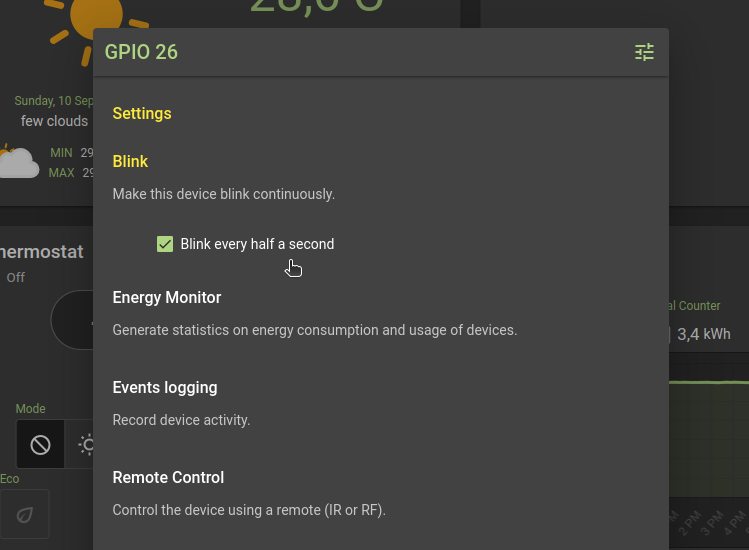
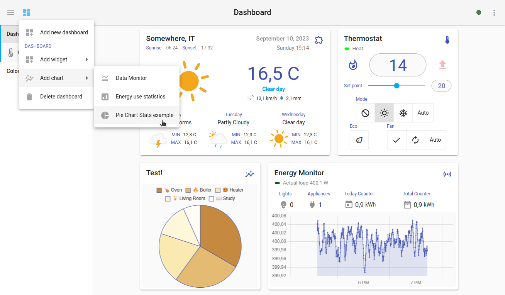
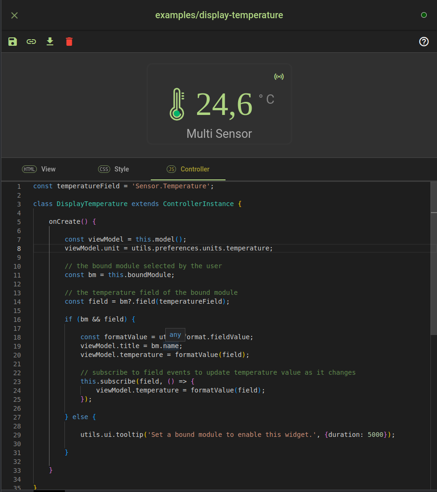

## More than just Smart Home

Despite the name, HomeGenie is not just a *Smart Home* server.
HomeGenie is a **general-purpose automation server** that routes and processes "signals"
and that integrates a series of tools to customize the user interface and the system
*intelligence* by the mean of small *automation programs* and *widgets* that can be
implemented and tested directly in the browser.

It is exactly the set of installed widgets and programs that determines and shapes this
general-purpose automation system into something specific, like a *Smart Home Server*,
a *Smart Thermostat*, or even a *Robot* :)


For example if HomeGenie were installed on a single board computer (such as Raspberry Pi)
with a temperature sensor, a switch relay and a display, it that case it would specifically
implement a *[smart thermostat](../../create/smart-thermostat)*.  
A multiple HomeGenie installation on an interconnected
system of single board computers with sensors, actuators, motors and such, in that case it
would be probably about implementing some kind of *robot* 🤖

**Deploy and share your creations easily**

Whatever purpose you are using HomeGenie for, as described in the [System settings](../../settings) page,
all custom *widgets* and *automation programs* can then be organized into packages or whole system backups
can also be created, to easily redistribute and deploy your creations.


## Programmable features

To understand what *"programmable features"* means, let's see a basic example
about how to implement a custom "Blink" feature that when enabled on a light
or switch, will make it blink continuously.

We simply add a new automation program giving it the name of the feature, *"Blink"*,
and a brief description that states what this feature will do: *"Make this device
blink continuously"*.

The code required to implement such feature is as simple as the following: 

```csharp
// Setup
Program.AddFeature(
  "", // affected domain filter or empty string for all
  "Light,Dimmer,Color,Switch", // affected types filter
  "ExampleFeature.Blink.Enable", // feature field name
  "Blink every half a second.", // feature description
  "checkbox" // type of input to control this feature field
);
```

With this `Program.AddFeature` API method, the program is adding to the
system a new feature that will show up in the *Settings* dialog of every 
device, matching the given domain/type filter, with a *"checkbox"* input
to enable or disable the *Blink* feature as shown in the following image:


<div class="media-container">
    
</div>

To actually make blink all devices with the option enabled, the program
will use the following code:

```csharp
// Main
while (Program.IsRunning) {
  Modules
    .WithFeature("ExampleFeature.Blink.Enable")
    .Toggle();
  Pause(.5);
}
```

where the `Modules` helper class is used to select all devices with
the *"Blink"* feature enabled and toggle them.  

So, basically, whenever the feature *Blink* is enabled on a device, it will start to blink as
shown in the following video.

<div class="media-container">

  <video id="video1" src="images/features_example_blink.webm"
       controls muted
       poster="images/features_example_blink.png"
       style="max-width:100%;"></video>

</div>
<script type="text/javascript">
const video1 = document.getElementById('video1');       
video1.addEventListener('ended',function(){
    video1.load();     
},false);
</script>


So, as we can see in the video above, other features are already available in
HomeGenie such as *Events logging*, *Remote Control*, *Security Alarm System*,
*Smart Device* &mdash;
all of them are implemented using small automation programs like the *Blink*
program, and so they can be enabled, disabled or even edited and customized!


## Common interface for all things

In the previous example we've seen the `Modules` helper class
used to select all devices with the *Blink* feature enabled and
to make them blink using the `.Toggle()` command.
This will work on all devices despite the brand or different
protocols used. 


<div class="note-box">
In <em>HomeGenie</em> a <strong>module</strong> is the most generic entity used to represent any kind of device,
program, service or more in general any controllable input/output entity.
</div>


Either you want to integrate directly an electronic component, smart home
devices from different brands and protocols, or external services, in
*HomeGenie* they all will speak the same language and will share a
common set of API commands.

As an example let's see how a *DHT-22* temperature and humidity sensor can be
easily integrated in *HomeGenie* using an automation program.

```csharp
// assign an arbitrary domain/address to identify this device
var domain = "Components.DHT22";
var address = "23"; // the GPIO number connected to DHT data pin
// Add a new module for the DHT sensor
Program.AddModule(domain, address, "Sensor");
// Get the Module instance
var dhtModule = Modules
      .InDomain(domain)
      .WithAddress(address).Get();
```

With the instructions above, the program is adding a new module that will be used
to signal new values read from the *DHT-22* sensor using the `Emit(..)` API method:

```csharp
// [code to read values from sensor omitted]
// emit sensor values
dhtModule
   .Emit("Sensor.Humidity", humidity.Percent)
   .Emit("Sensor.Temperature", temperature.DegreesCelsius);
```

And with just those few instructions, we now have a fully functional sensor integrated
in the system with event logs, data processing, monitoring and all other features implemented
for any module of type *"Sensor"*, as shown in the following video:


<div class="media-container">

  <video id="video2" src="images/features_modules_api.webm"
       controls muted
       poster="images/features_modules_api.png"
       style="max-width:100%;"></video>

</div>
<script type="text/javascript">
const video2 = document.getElementById('video2');       
video2.addEventListener('ended',function(){
    video2.load();     
},false);
</script>


## Data processing and visualization

Also data processing and visualization can be customized using automation programs, and it's
possible to add custom data filters or new kind of charts.

For this purpose the API methods `Program.Implements(..)` and `Api.Handle(...)` can be used
as described in the *Data Processing* page later in this guide.


<div class="media-container">
    
</div>


The data monitor component is designed for 
**real-time data visualization** and proven to be 
blazing fast on mobile devices too as shown in the video
below.

<div class="media-container" style="background: #224">

  <video id="video3" src="images/features_data_visualization.webm"
       controls muted
       poster="images/features_data_visualization.png"
       style="max-width:100%; max-height: 560px"></video>

</div>
<script type="text/javascript">
const video3 = document.getElementById('video2');       
video3.addEventListener('ended',function(){
    video3.load();     
},false);
</script>


## Custom Widgets

Even if HomeGenie built-in widgets could already be enough 
for most applications, it is possible to create custom widgets
using the integrated widget editor.

<div class="media-container">
    
</div>

See the *Custom Widgets* page for a complete documentation about
writing custom widgets.
