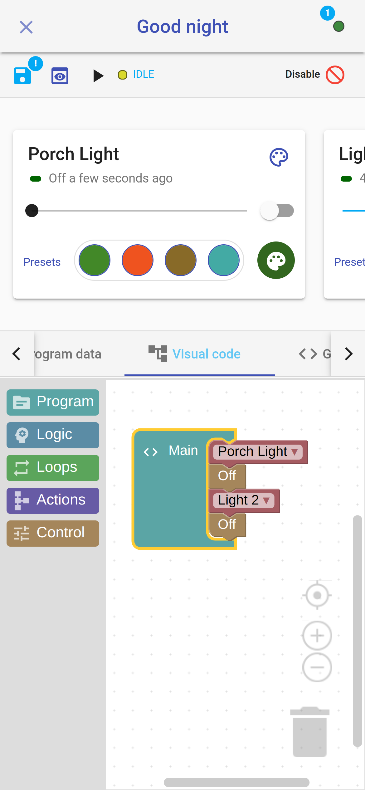

## Easy and effective   

With *HomeGenie*, you can create common automation tasks and scenes effortlessly.
No need to learn or use any programming language to customize your smart system.

## Visual Program editor




<div>
    
    With the *Visual Program* editor, you can create a scene by just dragging
and dropping commands from ...
    
</div>

<div>
    
</div>



---



<div>
    
    With the *Visual Program* editor, creating a scene it's just a matter of ...
    
</div>

<div class="media-container">
    
</div>



(*script recording* actually only available in *HomeGenie Panel*, it's planned to be implemented for visual script as well )
...

## Client side scenes with HomeGenie Panel

(client side)

```
Example script recording -- UPnP media server and tv with
light effects scene
```

....
