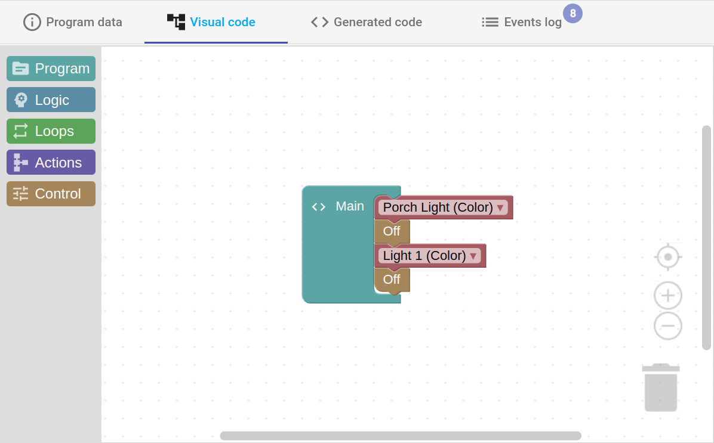
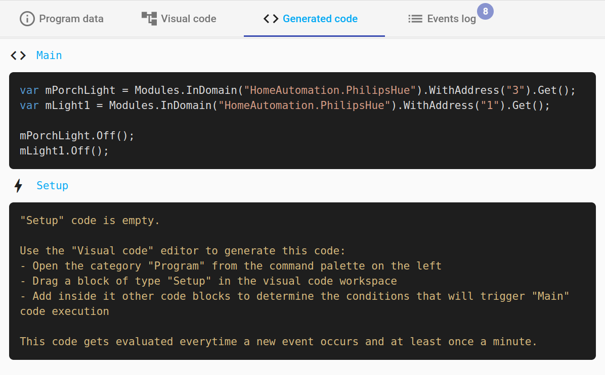
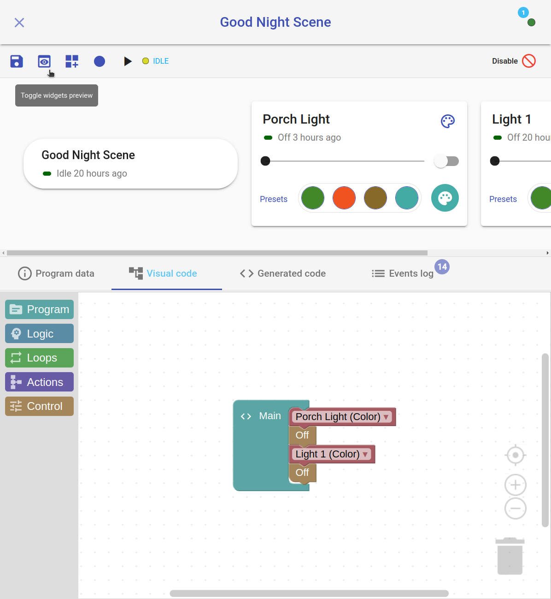
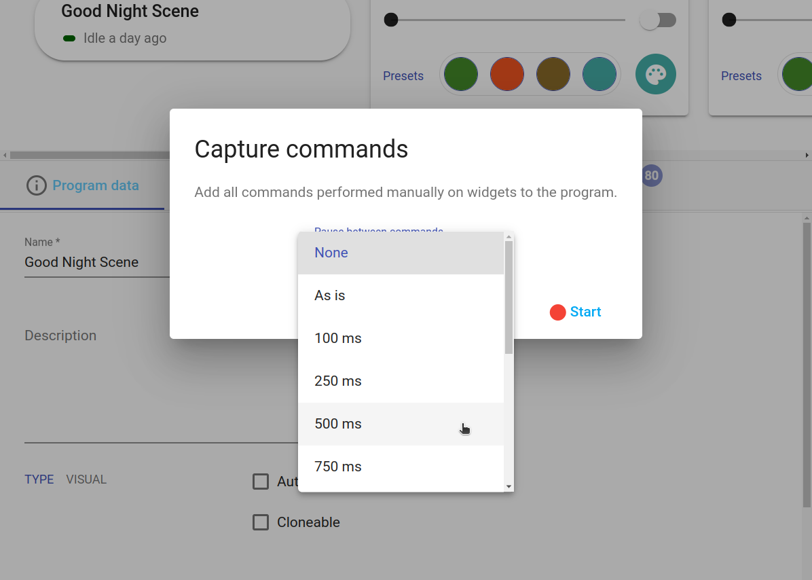

## Easy and effective   

With *HomeGenie*, you can create common automation tasks and scenes effortlessly.
No need to learn or use any programming language to customize your smart system.


## Visual programming

With the *Visual Program* editor, you can create a scene by just interacting with
widgets or by dragging and dropping commands from the *Blocks* toolbox located on the left
side of the visual editor area.

The logic flow and the commands of the scene are in fact represented as colored blocks that can be
easily modified and rearranged with your fingertips without ever writing a single line of
code.

<div class="media-container">
    
</div>


Indeed, the "behind the scenes code" is automatically generated by the visual editor engine
and can be viewed clicking on the *Generated Code* tab.

<div class="media-container">
    
</div>


This could also be a simple way to explore and learn how to use [*Automation Programs API*](../../../api/1.4/ape/annotated.html)
to write more complex scenes or advanced programs using any of the supported programming languages (C#, JavaScript, Python).


### Live recording a scene

Using the visual editor toolbar you can enable *widgets preview*
(preview) where is possible to display and interact
with widgets of devices and other things involved in the scene's script.

<div class="media-container">
    
</div>

Is also possible to manually select *actors* of the scene using the *"Select modules"*
(dashboard_customize) button, even if they are not yet
employed in the scene script. This is especially useful when enabling the
*capture commands* (fiber_manual_record) functionality
to record the scene's script in real time by interacting with widgets.

<div class="media-container">
    
</div>

When the *Capture commands* functionality is enabled any command performed on a widget
in the preview area will be automatically added to the program's *Main* block adding a
user-configurable pause between each performed commands.

<!--
TODO: 

### Using the blocks toolbox


---


## Client side scenes with HomeGenie Panel

(client side)

```
Example script recording -- UPnP media server and movie playback on a tv, with
a few light effects scene
```

....

-->
