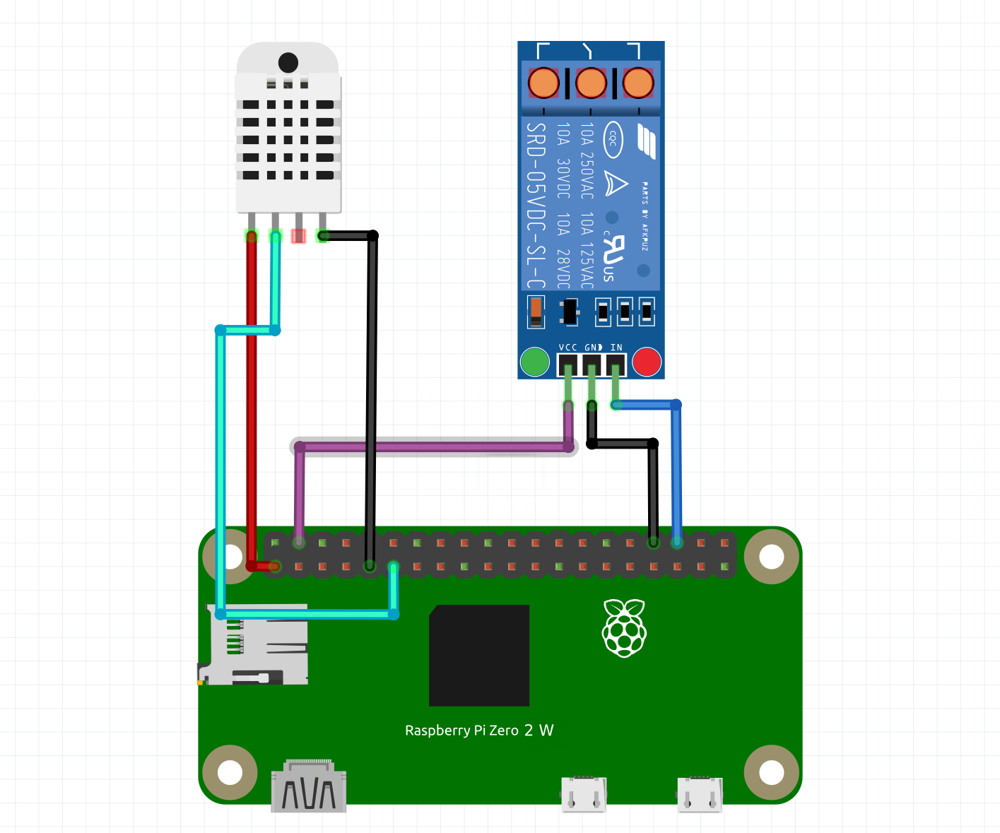
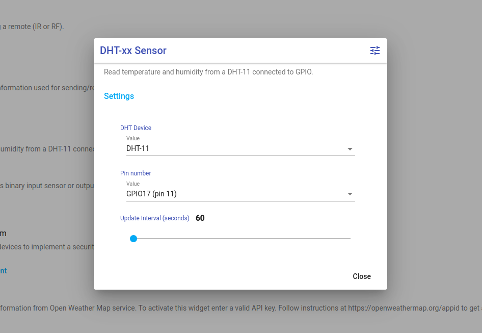
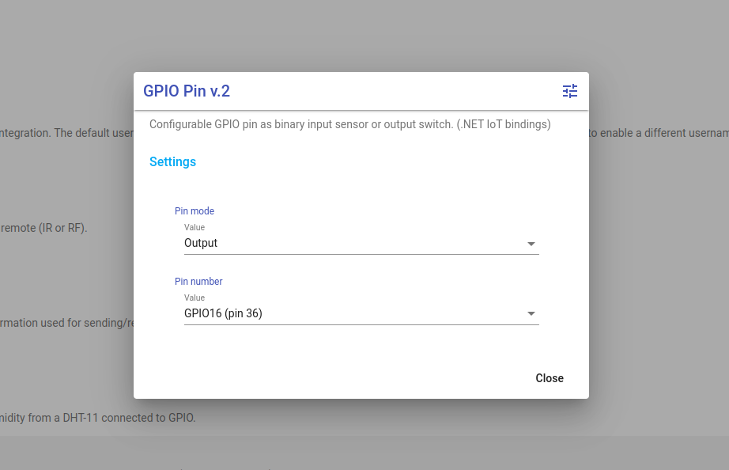
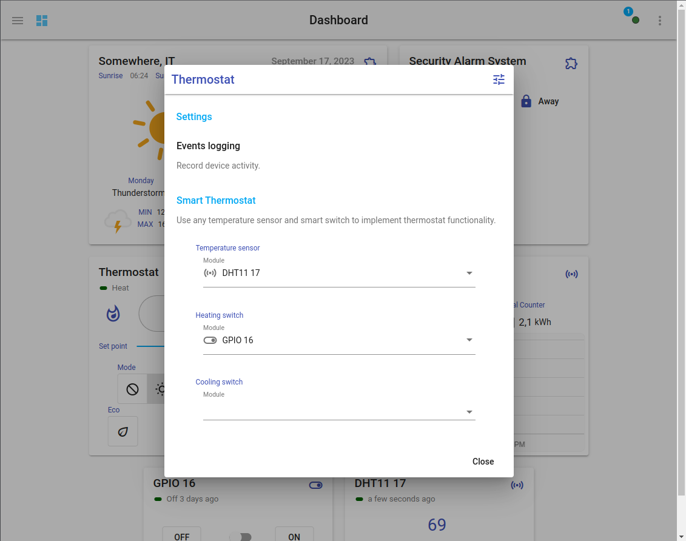
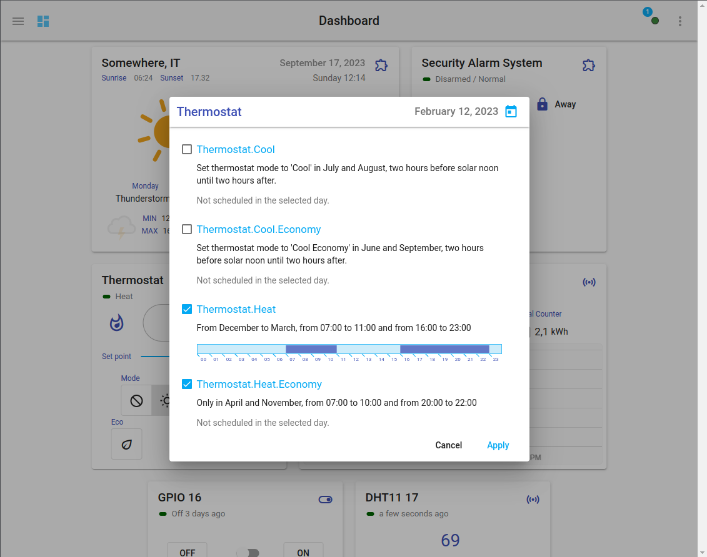
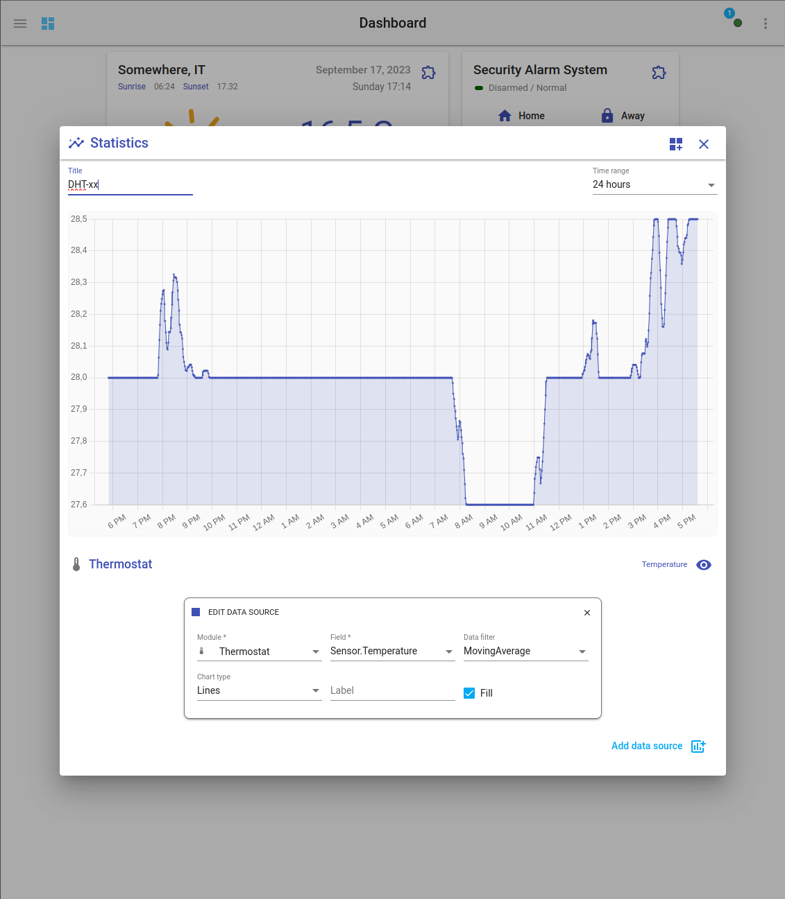

## Ingredients

- a Raspberry Pi with [HomeGenie installed](../../getting-started) (a model [Zero 2 W](https://www.raspberrypi.com/products/raspberry-pi-zero-2-w/) is cheap and perfect for this)
- a DHT-xx humidity and temperature sensor (DHT-11 or DHT-22)
- a Relay Switch

**What you will get**

A smart thermostat that **works 100% offline** and where **your own your data**,
with logging, statistics, powerful scheduler, automation engine, smart-home-ready
gateway with support for ZigBee, Z-Wave and X10, UPnP/DLNA control point,
and more... **all for less than $25**.

### Step 1 - connecting components

Connect components as shown in the following schema:

    
    <figcaption><strong>1.1</strong> Components connection schema</figcaption>

**DHT-xx**

- Pin 1 (**VCC**)  -> to GPIO pin 1  (**3V3**)
- Pin 2 (**DATA**) -> to GPIO pin 11 (**GPIO17**)
- Pin 4 (**GND**)  -> to GPIO pin 9  (**GND**)

**Relay Module**

- Pin 1 (**VCC**)  -> to GPIO pin 4  (**5V**)
- Pin 2 (**GND**)  -> to GPIO pin 34 (**GND**)
- Pin 3 (**IN**)   -> to GPIO pin 36 (**GPIO16**)

### Step 2 - configuring DHT-xx and relay switch

Enable **DHT-XX** and **GPIO Pin** programs from the *Automation Programs* page,  
then you can configure both programs from the *System Settings* page as shown in
the pictures below.

    
    <figcaption><strong>2.1</strong> Configuring DHT-xx Sensor program to read data from DHT-11 sensor connected to GPIO17 (pin 11)</figcaption>

    
    <figcaption><strong>2.2</strong> Configuring GPIO Pin program to control a switch connected to GPIO16 (pin 36)</figcaption>

### Step 3 - configuring the Smart Thermostat

Open the default dashboard and click the menu button thermostat
of the *Thermostat* widget and select *"Settings"* to set the device to read the temperature
from (DHTxx 17) and the switch to be used to activate the heating (GPIO 16).

    
    <figcaption><strong>3.1</strong> Configuring thermostat sensor and switch</figcaption>

The *Smart Thermostat* is now ready to be used. You can change the schedules or
show statistics and use all other features available in *HomeGenie*.

    
    <figcaption><strong>3.2</strong> Thermostat schedules</figcaption>

    
    <figcaption><strong>3.3</strong> Thermostat statistics</figcaption>

