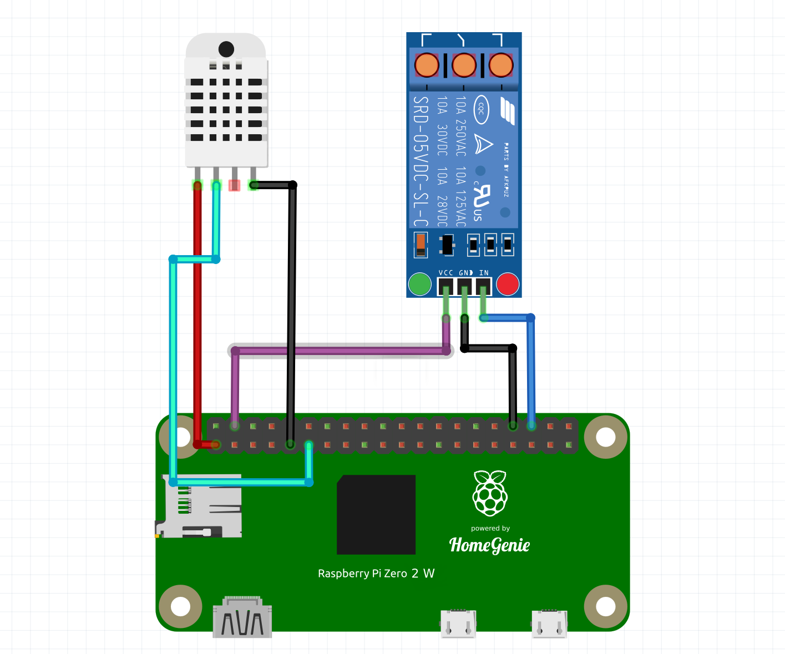

## Ingredients

- a Raspberry Pi with [HomeGenie installed](../../getting-started) (a model [Zero 2 W](https://www.raspberrypi.com/products/raspberry-pi-zero-2-w/) is cheap and perfect for this)
- a DHT-xx humidity and temperature sensor (DHT-11 or DHT-22)
- a Relay Switch

**What you will get**

A smart thermostat that **works 100% offline** and where **your own your data**,
with logging, statistics, powerful scheduler, automation engine, smart-home-ready
gateway with support for ZigBee, Z-Wave and X10, UPnP/DLNA control point...
**all for less than $25** !  😁

### Step 1 - connecting components

Connect components as shown in the following schema:

    

**DHT-xx**

- Pin 1 (**VCC**)  -> to GPIO pin 1  (**3V3**)
- Pin 2 (**DATA**) -> to GPIO pin 11 (**GPIO17**)
- Pin 4 (**GND**)  -> to GPIO pin 9  (**GND**)

**Relay Module**

- Pin 1 (**VCC**)  -> to GPIO pin 4  (**5V**)
- Pin 2 (**GND**)  -> to GPIO pin 34 (**GND**)
- Pin 3 (**IN**)   -> to GPIO pin 36 (**GPIO16**)

### Step 2 - configuring DHT-xx and relay switch

Enable **DHT-XX** and **GPIO Pin** programs from the *Automation Programs* page.  
Once enabled you can configure both programs from the *System Settings* page as
shown in the pictures below.

    

    

### Step 3 - configuring the Smart Thermostat

Open the *Settings* page of the *Thermostat* widget in the default *Dashboard*
and set the device to read the temperature from (the DHT-xx device) and the
switch to be used to activate the heating (the GPIO Pin switch).

    

The *Smart Thermostat* is now ready to be used. You can change the schedules or
show statistics and use all other features available in *HomeGenie*.

    

    

