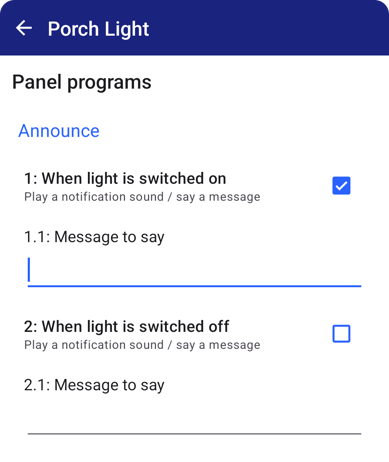

## A smart control panel for every room

Designed to be as fast and practical as physical buttons, *HomeGenie Panel* is an
application for controlling "things" from any Android device, either tablet or phone.  
Using pinned shortcuts, just one tap away from your phone's home screen, you can
activate lights or run scenarios just as quick as tapping a physical button in reach.



media:

- type: image
  preview: images/hgplus/hg_tablet_08.jpg
  url: images/hgplus/hg_tablet_08.jpg

- type: image
  preview: images/hgplus/hg_tablet_05.jpg
  url: images/hgplus/hg_tablet_05.jpg

- type: image
  preview: images/hgplus/hg_tablet_06.jpg
  url: images/hgplus/hg_tablet_06.jpg

- type: image
  preview: images/hgplus/hgplus_04.jpg
  url: images/hgplus/hgplus_04.jpg

- type: image
  preview: images/hgplus/hgplus_07.jpg
  url: images/hgplus/hgplus_07.jpg

- type: image
  preview: images/hgplus/hgplus_11.jpg
  url: images/hgplus/hgplus_11.jpg

- type: image
  preview: images/hgplus/hgplus_14.jpg
  url: images/hgplus/hgplus_14.jpg

options:
- name: slide
  value: 5000
- name: inline
  value: true



*HomeGenie Panel* features voice control, customizable dashboards, large buttons and indicators
to easily monitor and operate your smart devices such as lights, switches, thermostats, sensors,
media servers and smart TVs, and can handle multiple connections to *HomeGenie* servers
and *UPnP* devices.

Runs 24/7 flawlessly and does not require any Internet access to work!

  <a href="https://play.google.com/store/apps/details?id=com.glabs.homegenieplus&utm_source=global_co&utm_medium=prtnr&utm_content=Mar2515&utm_campaign=PartBadge&pcampaignid=MKT-AC-global-none-all-co-pr-py-PartBadges-Oct1515-1" class="button-85">Get HomeGenie Panel</a>

### Scenes and party-mode 🎶 🥳

With the *script recording* functionality you can live record and playback commands to create
scenes with ease, while the integrated *party-mode* can synchronize lights color and level with
the surrounding sounds and music creating suggestive lights effects.

  <video id="video1" src="images/panel_party_mode_01.webm"
       controls muted
       poster="images/panel_party_mode_01.png"
       style="max-width:420px; width:100%"></video>

The video above shows *Party-Mode* in action using a few RGB LEDs wired to a Raspberry Pi
with *HomeGenie Server* and controlled by an old Android 6 tablet running *HomeGenie Panel*
<small>(sounds muted due to copyright)</small>.

Commands automatically generated by *party-mode*, like any other manually issued commands
to control lights, media servers and smart TVs, can also be recorded to a script.

### Programmable

HomeGenie Panel also comes with a built-in automation engine that allow to write programs
using *JavaScript* to extend and customize the panel functionality.

For example, it is possible to play a sound when a certain device is switched on, or make
the panel say something using the internal speech synthesis.

    

It's also possible to program voice based interactions by making the panel
ask something and then wait for the user reply to determine the next
action to take.

So, in a context where multiple panels are installed in different zones, each one
can have a different configuration and implement individual automation tasks
that do not involve the use of a server/gateway at all.  

<a href="https://play.google.com/store/apps/details?id=com.glabs.homegenieplus&utm_source=global_co&utm_medium=prtnr&utm_content=Mar2515&utm_campaign=PartBadge&pcampaignid=MKT-AC-global-none-all-co-pr-py-PartBadges-Oct1515-1" class="button-85">Get HomeGenie Panel</a>

