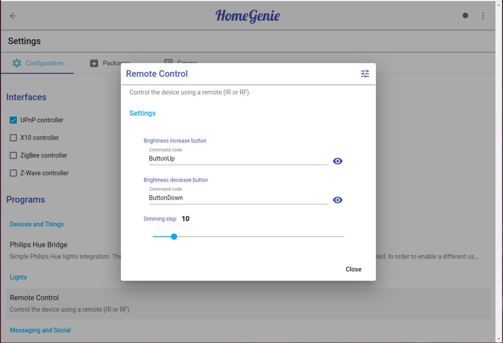
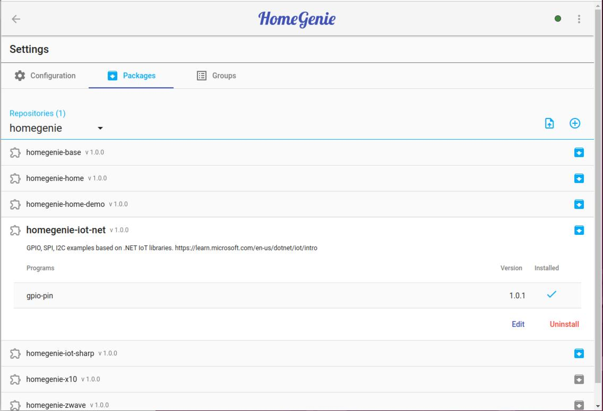
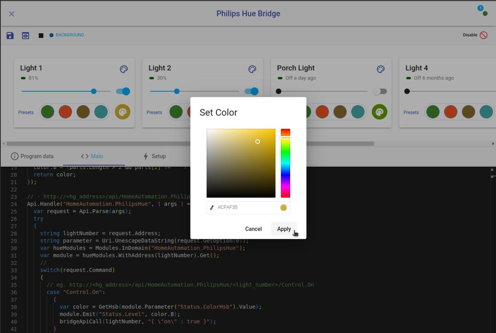
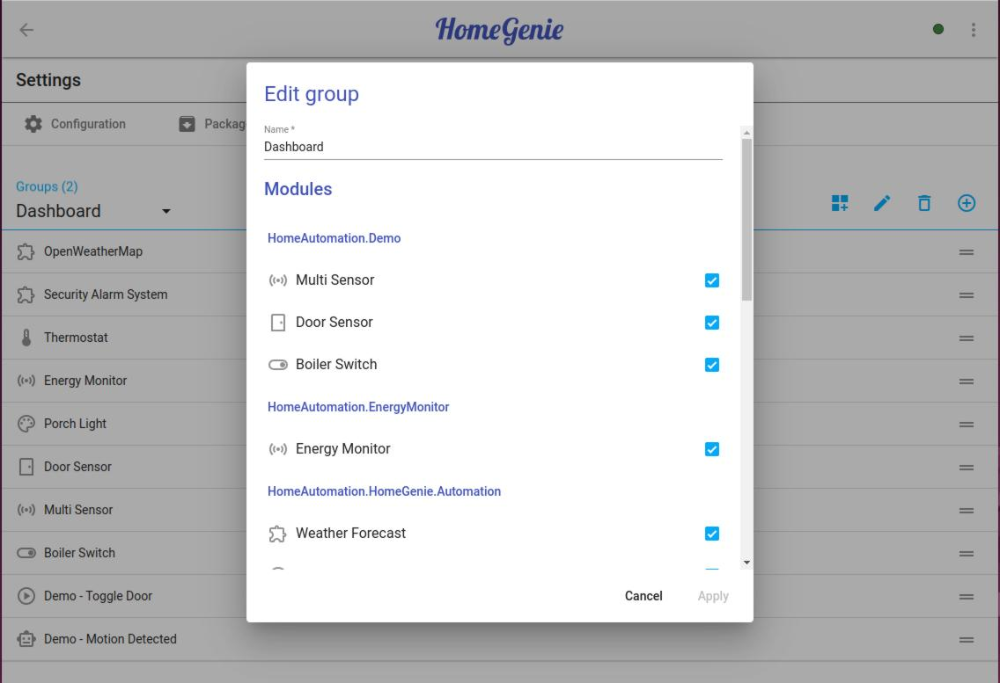
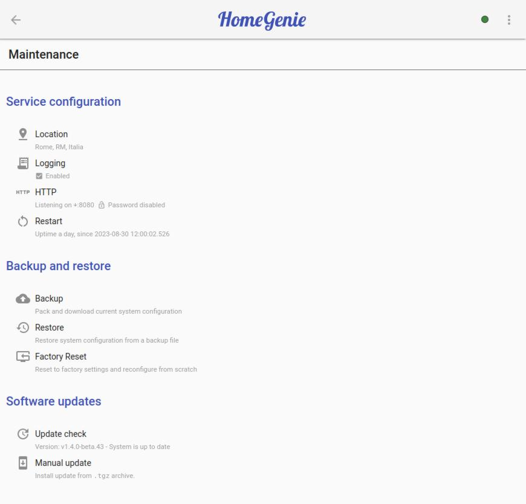

## Configuration

Through the system settings page it is possible to configure built-in interface
drivers and other options implemented by automation programs such as
*"Remote Control"* and *"Weather Forecast"*.

    

Depending on installed packages and custom programs, a different number of configuration
options will be available.

## Packages

Packages are basically a collections of automation programs that implement and extend
system functionality. A package contains usually programs that add a specific set of
functionality.

For instance, the package `homegenie-auto` contains smart home related
features such as the *Smart Device* program which adds to lights and switches the
capability of being activated by a motion sensor and based on ambient light level,
and automatically turn off after a certain period of inactivity (no motion detected),
or like the *Philips Hue Bridge (v1)* program which interfaces to the gateway for
controlling smart lights connected to it.

Selecting a package name from the list it will show further details, the list of
included programs, and buttons to *Install*, *Uninstall*, *Repair* or *Edit* the
selected package.

By editing a package it is possible to update or add new programs and generate a new
version of the package bundle that can be downloaded as a zip archive.

    

Package bundles can be imported by clicking the upload_file
upload button, while clicking the add_circle_outline button
it is possible to create a new package and bundle custom programs.

All packages must specify a repository name, which for user-created packages is by
default named `user`, but it can be any other name.

So, a repository is a collection of packages. All official HomeGenie packages are stored
in the **homegenie** repository.
It contains the base package (`homegenie-base`), which should be always installed,
and other optional packages such as:

- `homegenie-home`  
  Energy Monitor, Alarm System, Smart Thermostat and other base programs for smart home applications
- `homegenie-home-demo`  
  Virtual devices and simulated sensors activity to test the system.
- `homegenie-iot-*`  
  Examples using IoT libraries and interfacing to components via GPIO, SPI, I2C

Since all programs come in the form of source code, they can be modified using the integrated
program editor, so it's even easier to learn advanced topics for customizing and getting the
best out of your HomeGenie system.

    

## Control Groups
 
A group contain a set of programs, lights, switches, etc... that have the same logical
or functional meaning.  
For example a group called "Living Room", would contain all smart devices available in the
living room, or a group called "External Lights" would contain all external lights, and so on.

These groups can then be referenced in automation programs to quickly perform actions on multiple
devices belonging to the same group (e.g. turning off everyday all *"External Lights" at a
given time). 

Groups can also be used to quickly create new dashboards with a predefined set of devices in it,
and are also used in the *[HomeGenie Panel](../panel)* app for Android for the same purpose.

    

## System Maintenance

From the system maintenance page is possible to configure core service options (such as HTTP port
and logging), create or restore backups, reset to factory settings, update the software when
a new release is available.

    

