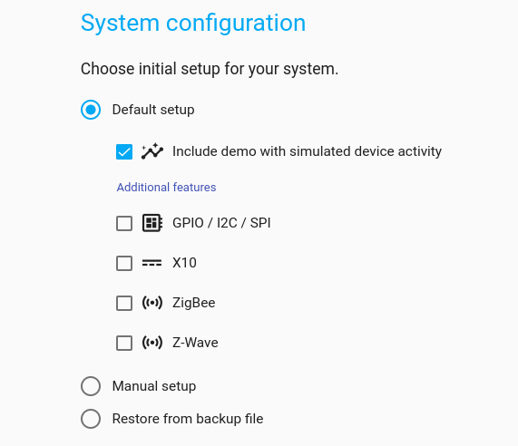

## Initial setup

When opening HomeGenie UI after the installation (or after a factory reset),
the Setup Wizard will walk you through a couple of simple steps to set the
base configuration of your system.

<!--

    
    
    

-->

Here you can enable built-in drivers for Raspberry Pi or other single board computers,
and smart home dongles.

If at this time you just want to try HomeGenie without using additional drivers or
hardware, you can choose to install the **demo** package which includes virtual devices
such as smart thermostats, switches, color lights, and a device activity simulator.

However, all these settings can also be changed later, after the initial setup,
from the *System settings* page.

### GPIO / SPI / I2C

When you enable the GPIO package, some sample programs will be installed such as
the *DHT-11 sensor* and *GPIO Pin* programs.
The **GPIO Pin** program allows to configure a GPIO pin as a switch to turn on an LED
or a relay, or as an input sensor, for instance, to detect when a button is pressed.

The following video demonstrates the initial setup procedure on a *Raspberry Pi Zero 2 W*
to enable GPIO and configure a pin as a switch to control an LED. It also shows
how to create a program for making the LED blink indefinitely.

  <video id="video1" src="images/homegenie_blink_02.m4v"
       controls muted
       poster="images/setup_wizard_rpi_blink.png"
       style="max-width:100%;"></video>

#### Limitless applications

Built-in automation engine takes advantage of *.NET IoT* and *RaspberrySharp* libraries,
through which is possible to integrate [thousands of components](https://github.com/dotnet/iot/blob/main/src/devices/README.md) (such as sensors,
motors, controllers, and displays) for building any kind of projects, maybe even an AI-driven
robot 🤖 if that's what you were thinking about 😀  
The integrated program editor alongside **C#** also supports **JavaScript** and
**Python** languages, so it's possible to access a wider range of libraries, examples and
applications.

### Smart Home

The following built-in smart home hardware can be enabled either in the initial setup, or later
from the system settings page:

#### X10

CM11 (Serial), CM15 (USB), CM19 (USB)

#### Z-Wave

Most Z-Wave serial controllers

#### ZigBee

CC25XX (Texas Instruments), XBee (Digi), Ember (Silicon Labs), ConBee (Dresden Elektronik)

In the video below an example setup using both *ZigBee* and *Z-Wave* hardware.

  <video src="images/homegenie_setup_wizard.webm"
       controls muted
       poster_dis="images/homegenie_setup_wizard.png"
       poster="images/setup_wizard_03.png"
       style="max-width:100%;"></video>

#### Additional drivers and features

Additional drivers and features can be integrated later via the package manager
or can be written ad hoc using the integrated program editor.
A few examples are already included in the package manager: *Philips Hue Bridge V1*,
*Crestron/KNX*, *WeMo* and more.  

### Manual setup and backup restore

With the manual setup it is possible to install just the base system and then
access the *System Settings* page to manually configure and customize every
single aspect of your automation project.

You can also quickly restore a fully preconfigured system using a previously
exported backup file from the *System Maintenance* page.
