## HomeGenie web user interface

The default server installation includes a web user interface that can be used either from a desktop PC or a mobile client such as Android or iOS device.
This is mainly intended for administration purposes to configure and access all aspect of the system.

    

## HomeGenie Plus for Android

Specifically designed to be a Control Panel for the end-user, **HomeGenie Plus** is a feature rich mobile client for your smart home and smart applications.

### Main features

- Multi-standard: can connect not just to HomeGenie server but also directly to [HomeGenie Mini](https://github.com/genielabs/homegenie-mini), Belkin Wemo, Philps Hue, TPLink, LIFX and any UPnP/DLNA media server or renderer (TV)
- Adaptive layout: automatically arranges widgets to best fit both on phone and tablet.
- Voice control
- UPnP/DLNA both browser and renderer control
- IP camera widget with full screen view
- "Keep Screen On" option: prevent the screen from turning off. Useful for wall-mounted panel installations.
- Parameter statistics and activity log: displays statistics and parameter logs of any configured modules.
- Module preferences: each client device can have its own settings and preference for configured modules.
- "Mini" view: some widgets, as the ones for lights and appliances, can be minified and hide extra options so that they just appear as a quick toggle button.
- Configurable groups: allows choosing modules and groups that will be available to the client device. If HomeGenie server has password protection enabled, only the administrator can change the configuration in order to limit the access from the client.
- Embedded automation program engine and API that allow adding custom automation logic using JavaScript

#### Screenshots - Phone

    <!--img self="size-medium" src="images/hgplus/hg_phone_00.jpg" /-->
    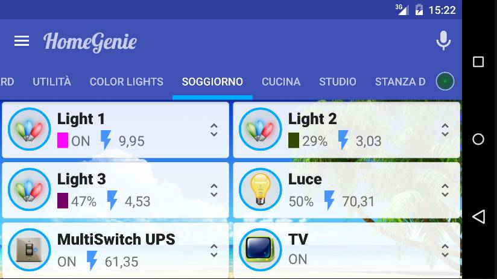
    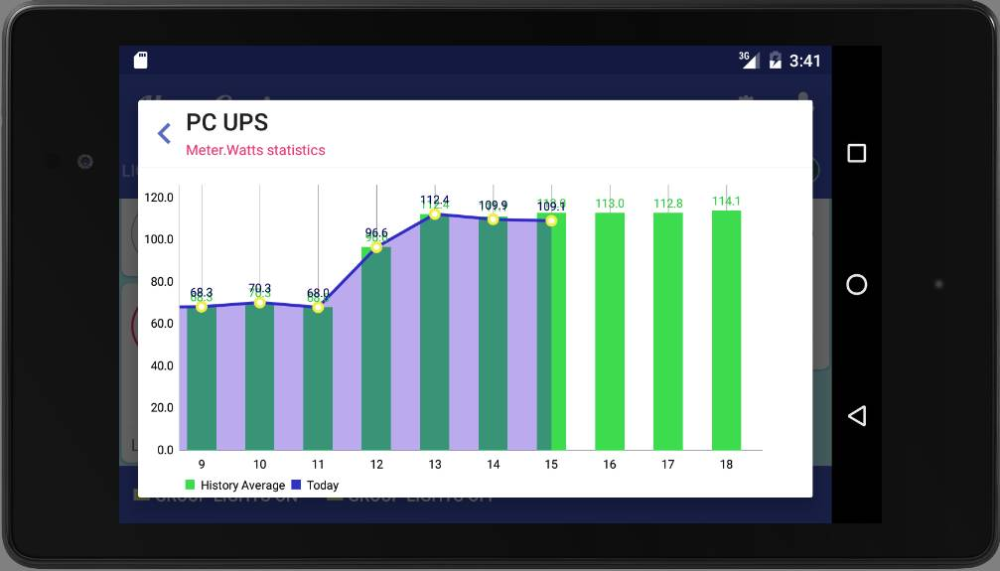
    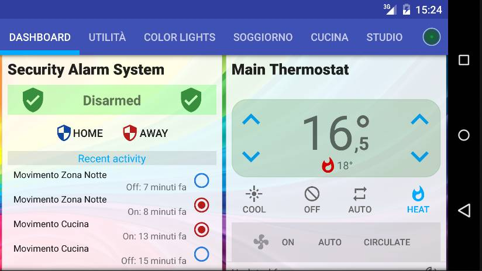
    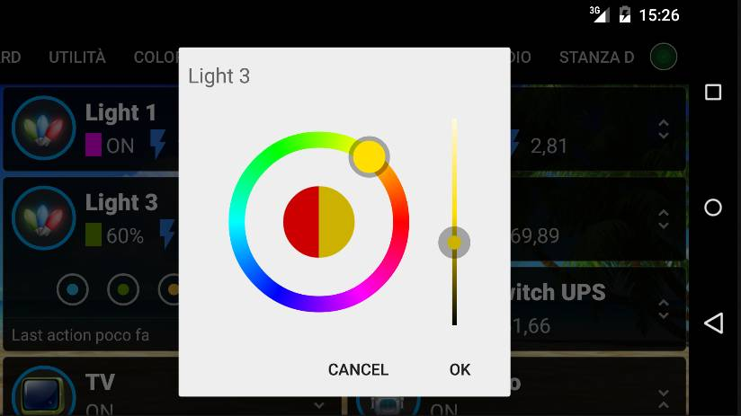
    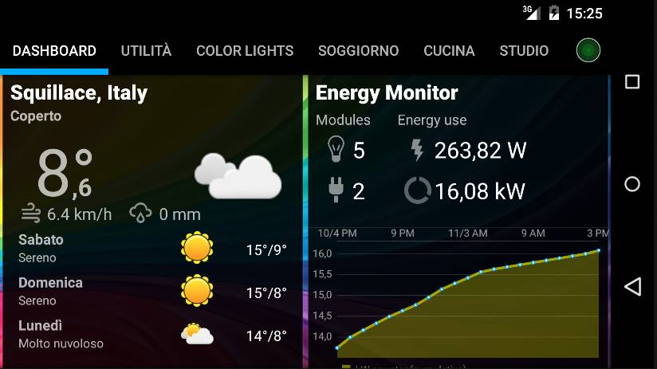
    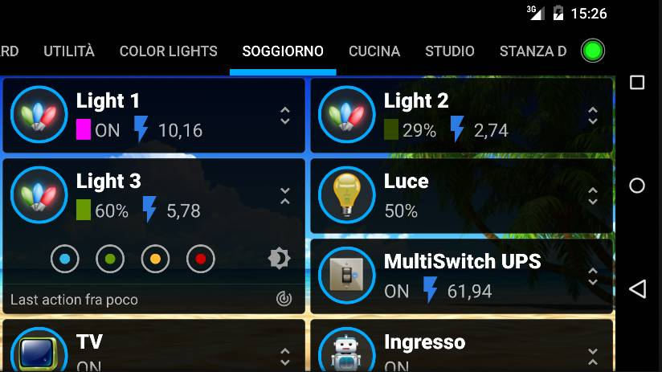
    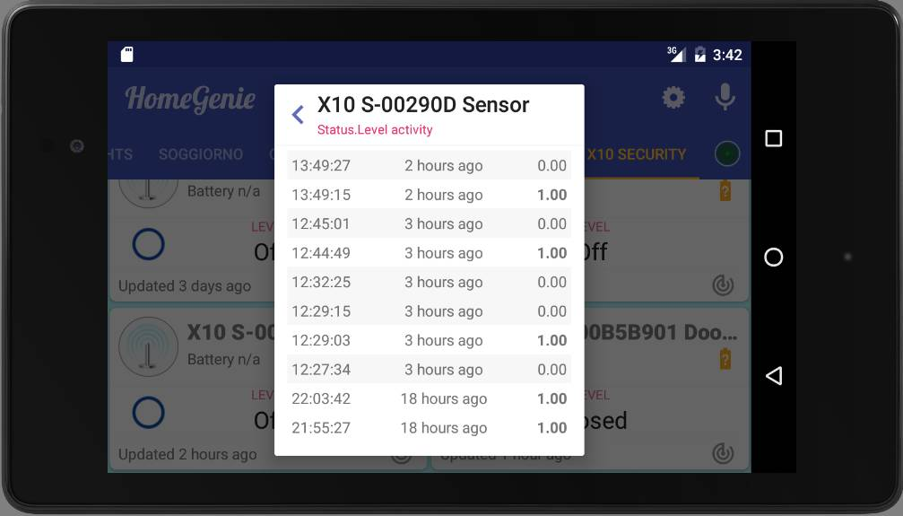

#### Screenshots - Tablet

    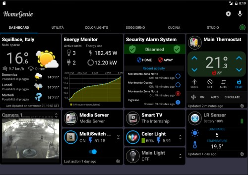
    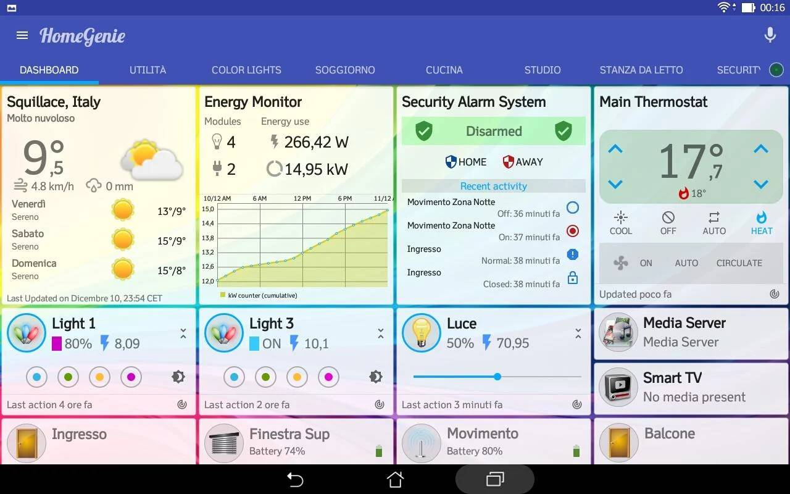
    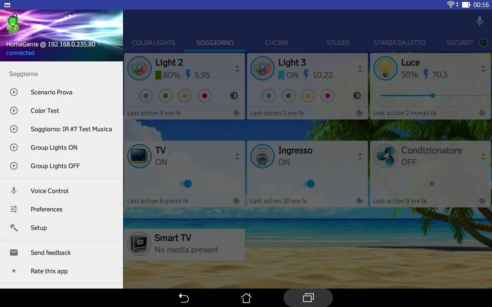
    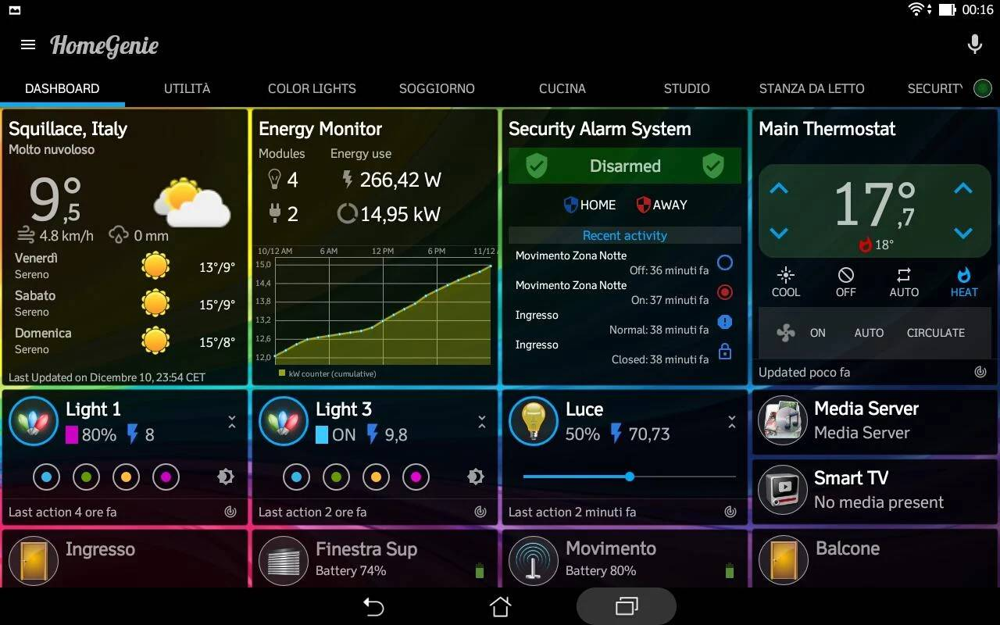
    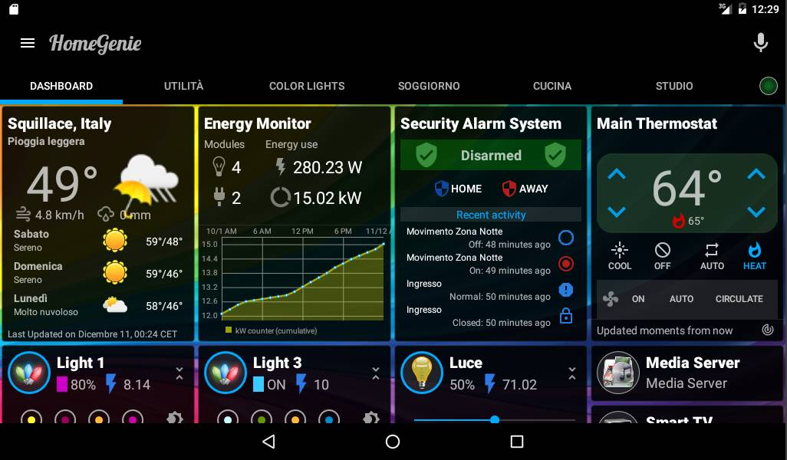
    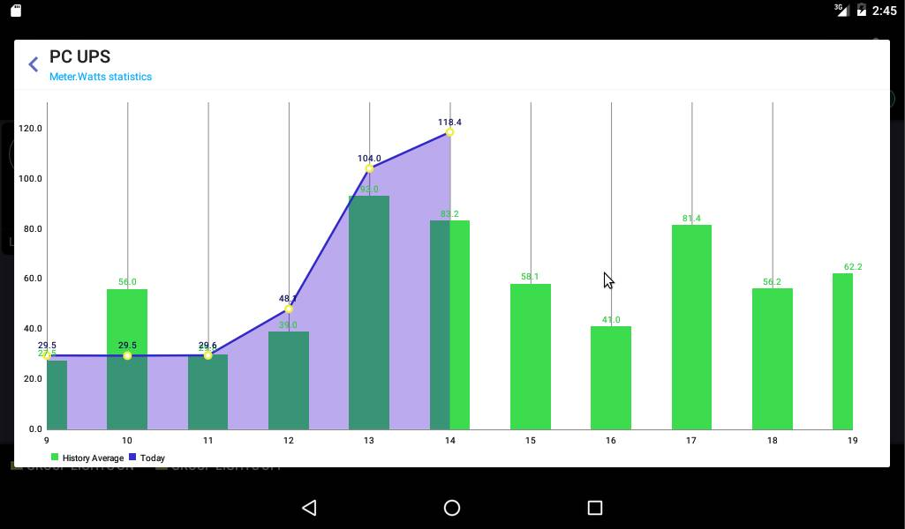
    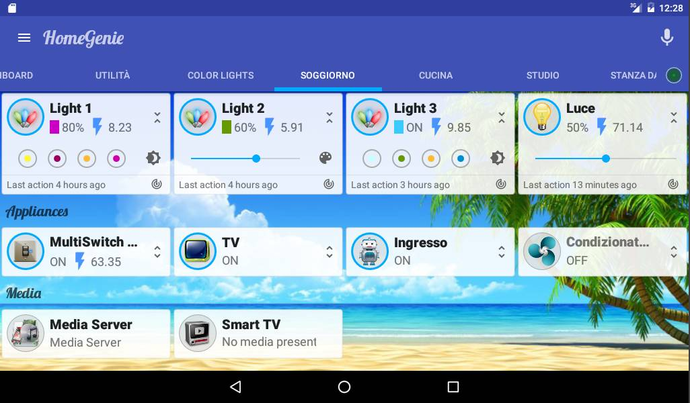
    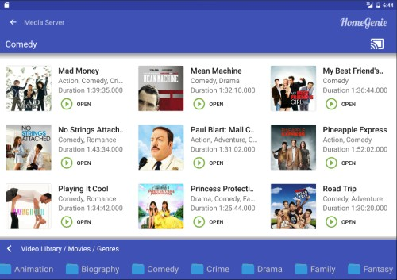
    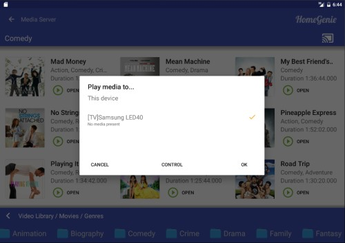
    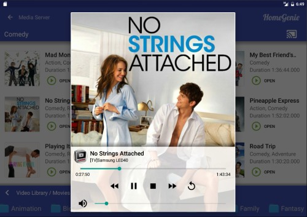
    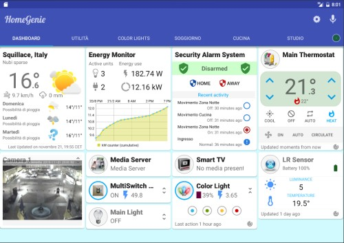
    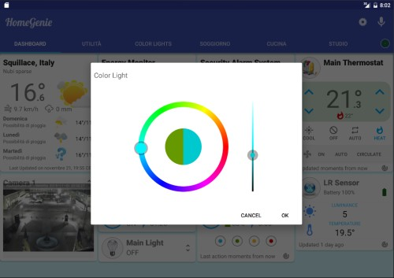
    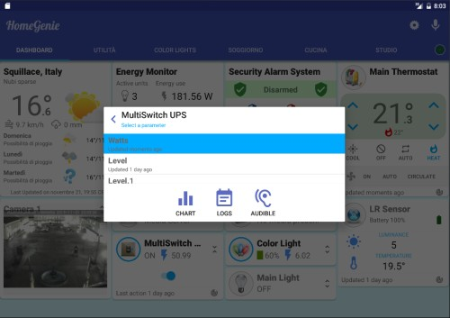
    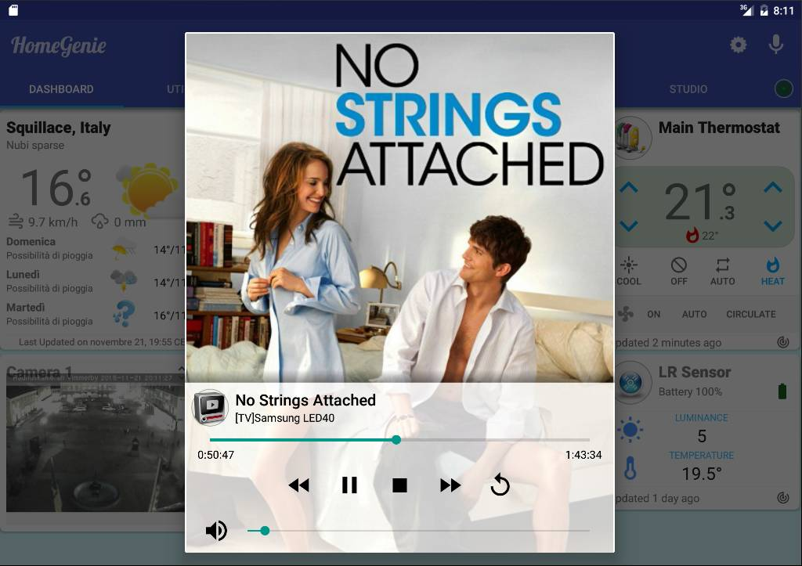
    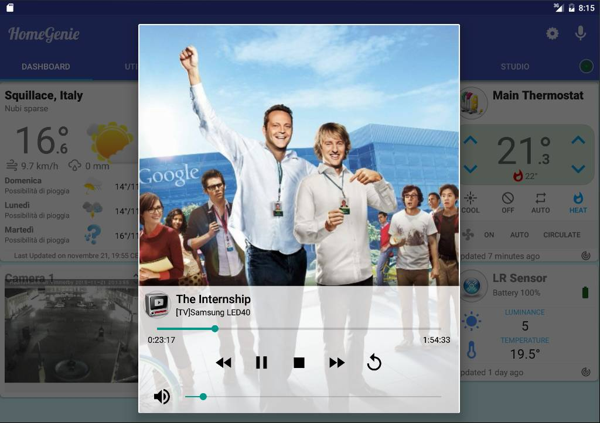
    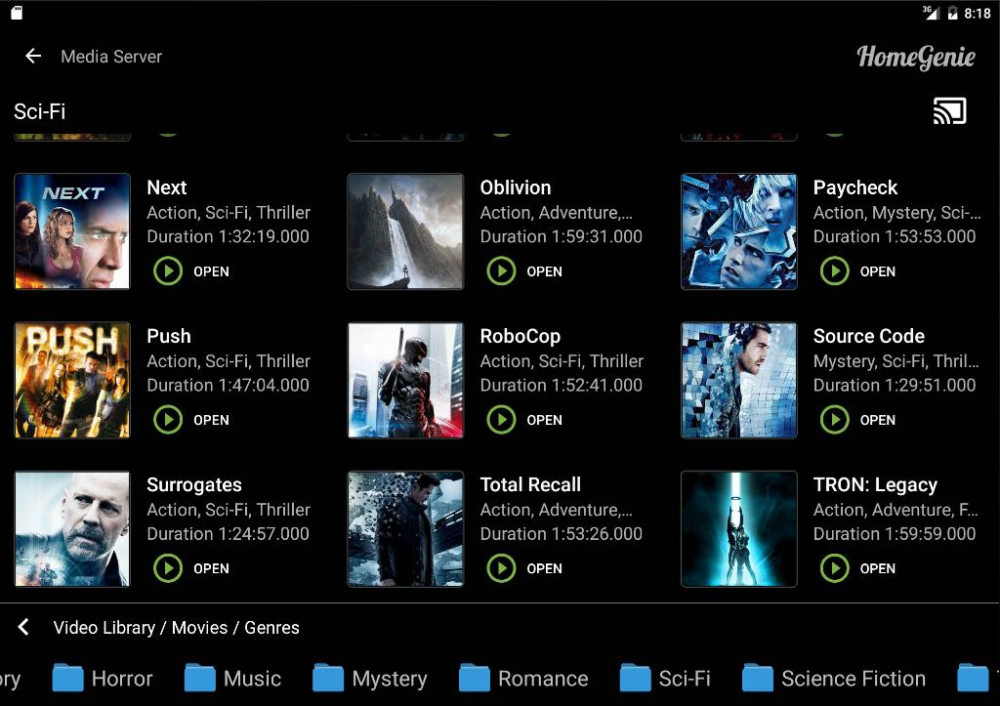

## Open Source clients

The open source clients for Android and Windows Phone are meant to be an example for developers who want to build their own custom client
using HomeGenie API.

### Android app source code

- [HomeGenie for Android on github](https://github.com/genielabs/HomeGenie-Android)

### Windows Phone 8.x client source code

- [HomeGenie for Windows Phone on github](https://github.com/genielabs/HomeGenie-WindowsPhone)
