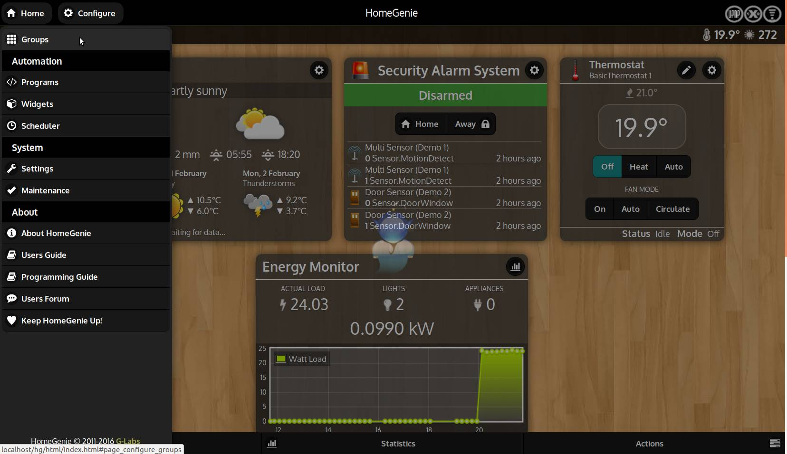
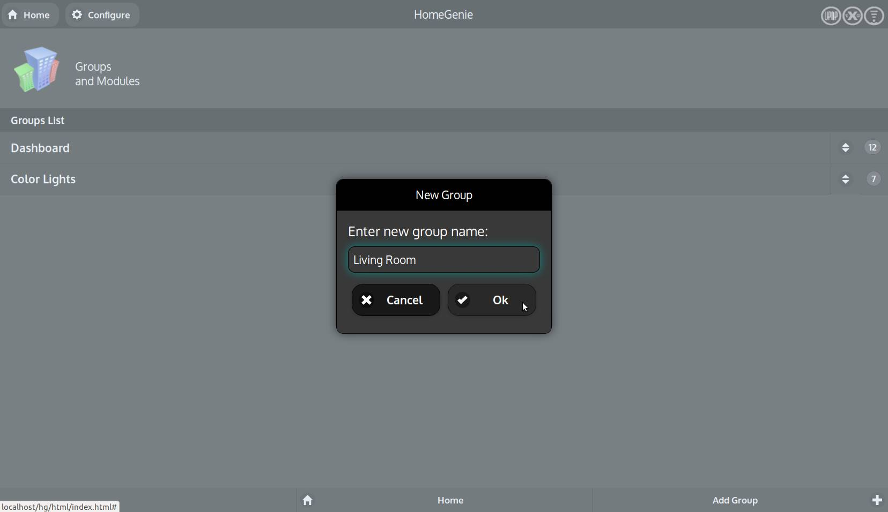
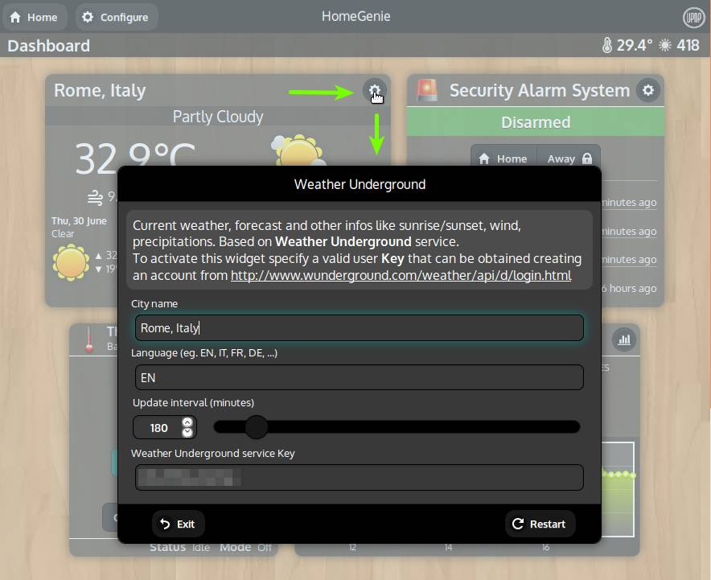
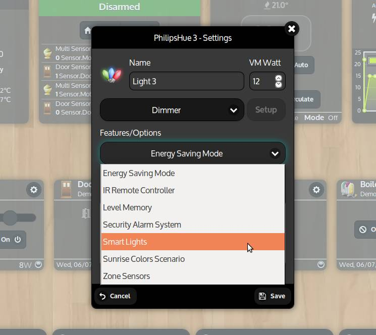

## Configuring groups

Smart devices and services (also simply called *modules*) can be organized
into *control groups*.

From the **<i class="material-icons">settings</i>Configure** menu
select the **<i class="material-icons">dashboard</i>Groups** option to
add and manage groups.
Click the **<i class="material-icons">add</i>Add Group** button located
in the *bottom bar* to add a new group.

To edit a group select it from the list. The group configuration page will be opened.
From this page we can add/sort *modules* in the group, change the wallpaper, rename or
delete it.

    
    
    

## Configuring widgets

We call *widget*, that part of the user interface through which a module is presented
and through which we can interact with it.

Depending on the type, a specific widget will be used to display a *module* (eg. all modules of type "Light" will be presented using the same kind of widget).
Most widgets will also have a **<i class="material-icons">settings</i>** (settings)
button in the upper right corner that can be used to configure the module.
Pressing this button a popup dialog will be opened.

Let's now see how to configure each of them.

### Weather forecast

HomeGenie can integrate also external services and make the data available to the system
so that it can be displayed and/or used for automating tasks.

A good example is the Weather widget that is based on [OpenWeatherMap](https://openweathermap.org) service.

To enable this widget the user is required to enter a *service API key* (APPID) that can be obtained by registering
on the *OpenWeatherMap* website.

    

After entering the location name and a valid API key, press the **<i class="material-icons">autorenew</i>Restart** button.
The widget will then retrieve updated forecast and other useful data.

This data can then be used to automate various tasks.
For example to open or close motorized window shades on behalf of the sun position
and the weather conditions (cloudy or not), or turning off the garden irrigation system
if it's raining outside.

### Security alarm system

If your setup includes smart devices such as motion/smoke/co2/etc.. detectors,
door/window sensors, then you can use them with the *Security Alarm System* widget.

The following video explain how to use this feature.

    <iframe self="size-medium" height="440" src="https://www.youtube.com/embed/jsL_fAJ5-5w?rel=0" frameborder="0" allowfullscreen></iframe>

<!--
In the picture below, you can see options for the *Security Alarm Widget*. It can be configured to send e-mails when the alarm is triggered and/or to run an automation program when the system is armed/disarmed/triggered.

    

-->

### Lights and switches

Also lights and switches have configurable options.
Some options are related to the integration with other services/widgets
(as already seen in the case of the alarm system), some other are used
to configure the behavior of the device itself.

Let's explore some of these options.

#### Smart lights

When this options is enabled, the device will react to any of the following events:

- *Motion Detection*:
  <i class="fa fa-long-arrow-right"></i>
  the device it will turn **on** if motion is detected from the specified sensor
- *Luminance*:
  <i class="fa fa-long-arrow-right"></i>
  the device it will turn **on** if luminance from the specified sensor is below a certain value
- *Timeout*:
  <i class="fa fa-long-arrow-right"></i>
  the device it will turn **off** if no event is detected for more than the specified amount of time (seconds)

    

#### Energy saving mode

Enable this option to limit the level of a dimmerable device to a maximum
predefined value (20% by default).

#### Level memory

Enable this option to restore last level when the dimmerable device is turned on.
This is useful when the device itself does not provide this feature
as it happens for some old *X10* dimmer modules.

### Thermostats

*HomeGenie* should recognize with most Z-Wave smart thermostats.
Drivers for other kind of thermostats are available through the *Package Repository*.

The standard installation also includes a *Basic Thermostat* application that can
be configured to add up to ten virtual thermostats.

Each of them can be configured to use an arbitrary temperature sensor and
any switchable device that is presumably connected to a real heating system.
So, when the temperature sensor is below the configured *Set Point*, it will activate
the switch and so the heating system and keep it active until the *Set Point*
temperature is reached.
