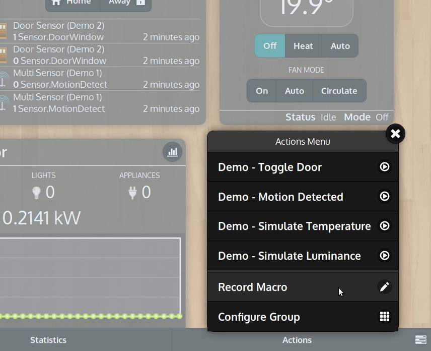

## Scenarios and scripts

To create scenarios, lighting effects or any other kind of automated script,
we can use the *Record Macro* functionality which is found in *Actions* menu
of the groups' page.

    

When **Record Macro** option is active, every action taken (eg. controlling lights/switches
from the user interface or with a remote control), will be stored in a script
(namely a *Wizard Script*).
By default, in the recorded script, it will be put *1-second delay* between each command.
We can switch between other kinds of timing while recording. One of these is called _Mimic_.
When Mimic is selected, the resulting script will replicate exactly the timing
we used during the recording session.

To end a recording session and save the script, click the *Save* button in the bottom bar.

## Wizard Scripts

After saving the script the *Wizard Script* editor will open.
From there, we can further edit the script, add/remove commands, change the name,
the description and the program group.

A Wizard Script is a type of **automation program** that requires no programming knowledge
and it can be either automatically created from the *Record Macro* functionality,
as just discussed, or manually from the *Programs* page.

### Performing

There are different ways in which a script can be performed:
- from inside the *program editor* by pressing the *Run* option located in the *Actions* menu
- it can be added to a *group* just as it happens with regular *modules*, in which
case it will appear as a button that can be pressed to run/stop the script
- it can also be automatically performed when certain conditions occurs

    <iframe self="size-medium" height="440" src="https://www.youtube.com/embed/zwqJ3YeqOTc?rel=0" frameborder="0" allowfullscreen></iframe>

See the above *How-To* video for further information.

 
