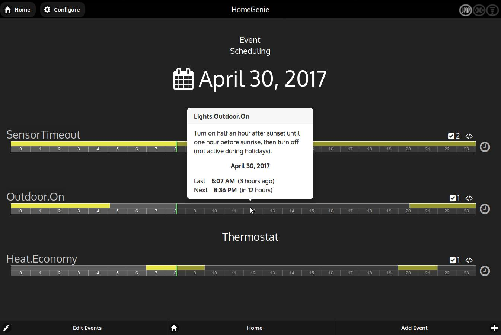
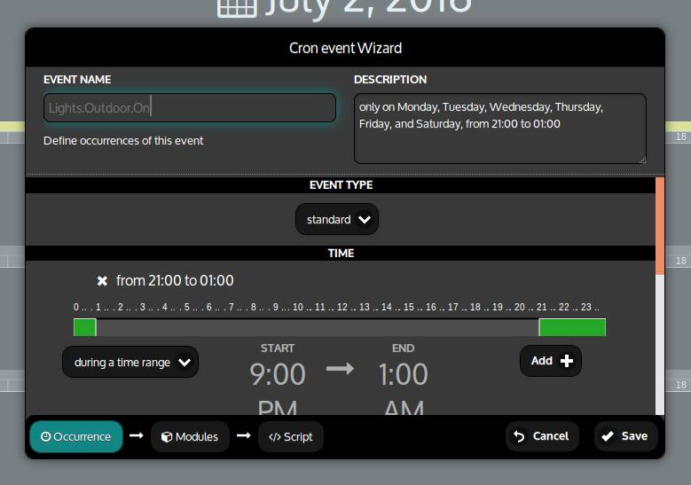

## Scheduling

With the *Scheduler*, which is available from the *Configure* menu,
*HomeGenie* can be programmed to take some actions on time based occurrences.

The main *Scheduler* page is the calendar view that shows programmed events
for the day. By clicking the date text, we can choose a different
date so to display programmed events for any given day.

<div class="media-container">
    
</div>

The time-line of an event will have a yellow bar to indicate the time ranges
where the event occurs. If it's grayed out it means that the occurrence is
in the future and has not occurred yet. Passing the pointer over it
will display a popup with a summary of the event and its last/next
occurrence (see above picture).

It can also have some indicators on the right:

&nbsp;&nbsp; <i class="material-icons bigger">check_box</i> number of modules bound to the scheduled event

&nbsp;&nbsp; <i class="material-icons bigger">code</i> a script is associated with the scheduled event


### Cron event Wizard

When adding or modifying a scheduled event, the *Cron event Wizard* window will
be shown, there we can edit occurrences, bound modules and associated script to run.

An event should at least define the occurrences, while bound modules and script are
optional.

<div class="media-container">
    
</div>


#### Occurrence

From the *occurrence* panel of the scheduler wizard we can define the main data of the event.

**Name and description**

The name of the event must not contain any white space or special characters.
The only allowed non alpha-numeric character is the dot `.`, that is used to
categorize/group events. For example all events related to the *thermostat*
scheduling will be like:

- "**Thermostat**.**Heat**.**On**"
- "**Thermostat**.**Heat**.**Economy**"
- "**Thermostat**.**Heat**.**Off**"

This way events will be grouped under *Thermostat* category in the *calendar view* as
shown in the first picture early in this page.

The *description* field can instead contains a verbose description of the event.
Notice that once an event is created it's name cannot be modified.

**Event type**

There are three types of event:

- **standard**: can be defined by one or more occurrence of time and/or time ranges
and can optionally be limited to certain days or months.
- **date period**: same as *standard* event but it will only be valid during a
given period of the year.
- **custom cron expression**: can be defined with textual expressions that are described
later on this page. This kind of events can also include reference to other events and
can implement complex set of occurrences.


#### Modules

In the modules panel we can select modules that are bound to the event and
that can be operated by the associated script.


#### Script

The script code entered in this panel, will be executed on every occurrence of an
event. The language used is *JavaScript* and all HomeGenie Server *Helper Classes*,
accessible to standard automation programs, are also exposed to the script through
the following objects:

- `$$.modules` - ModulesHelper
- `$$.program` - ProgramHelper
- `$$.settings` - SettingsHelper
- `$$.net` - NetHelper
- `$$.serial` - SerialHelper
- `$$.tcp` - TcpHelper
- `$$.udp` - UdpHelper
- `$$.mqtt` - MqttHelper
- `$$.knx` - KnxHelper
- `$$.scheduler` - SchedulerHelper

See [Helper Classes](../../../api/ape/annotated.html) documentation for a detailed description.

In addition to that, an event script can use some special objects/methods:

- `$$.boundModules`:
a *[ModulesHelper](../../../api/ape/class_home_genie_1_1_automation_1_1_scripting_1_1_modules_manager.html)* object containing modules selected in the *Modules* panel for the event.
For example for turning on all bound modules we'll use: `$$.boundModules.on()`.
- `$$.onPrevious()`:
boolean value indicating if the event was scheduled in the previous minute.
- `$$.onNext()`:
boolean value indicating if the event will be also scheduled in the next minute.
- `$$.data(k[,v])`:
function to store data for this event and that will be available to the script across each occurrence.
- `$$.onUpdate(function(m,p))`:
used to set an handler for listening to modules events. Once registered the handler will be called even
if the event is not scheduled.
- `$$.pause(seconds)`: pause the script for the given amount of time

### About cron expressions

Cron expressions are strings that are actually made up of five sub-expressions, that describe individual details of the schedule. These sub-expressions are separated with white-space, and represent:

- Minutes
- Hours
- Day-of-Month
- Month
- Day-of-Week

Individual sub-expressions can contain ranges (eg. 8-22) and/or lists (eg. 5,10,30,45).

Wild-cards (the '\*' character) can be used to say “every” possible value of this field. Therefore the '\*' character in the *Month* field of the previous example simply means “every month”. A '\*' in the Day-Of-Week field would therefore obviously mean “every day of the week”.

All of the fields have a set of valid values that can be specified. These values should be fairly obvious – such as the numbers 0 to 59 for minutes, and the values 0 to 23 for hours. Day-of-Month can be any value 1-31. Months can be specified as values between 1 and 12. Days-of-Week can be specified as values between 0 and 6 (or 1 to 7 since both 0 and 7 stand for Sunday).

The '/' character can be used to specify increments to values. For example, if you put '0/15' in the Minutes field, it means 'every 15th minute of the hour, starting at minute zero'. If you used '3/20' in the Minutes field, it would mean 'every 20th minute of the hour, starting at minute three' – or in other words it is the same as specifying '3,23,43' in the Minutes field.


#### Example Cron Expressions


**Example 1** An expression to create a trigger that simply fires every 5 minutes

```
0/5 * * * *
```

**Example 2** Every even minute

```
*/2 * * * *
```

**Example 3** Every odd minute

```
1-59/2 * * * *
```

**Example 4** Every 5 minutes, Weekdays from 8am-5pm.

```
*/5 8-16 * * 1-5
```


Cron expressions can also be grouped using parenthesis and combined using the following operators:

- **` ; `** &nbsp; *AND*
- **` : `** &nbsp; *OR*
- **` > `** &nbsp; *UNTIL* (time range, 'from' > 'to')
- **` % `** &nbsp; *EXCEPT*


**Example 5** From 11:20PM to 3:15AM

```
(20 23 * * *) > (15 3 * * *)
```

**Example 6** From 11:20PM to 3:15AM except in May(5) and September(9)

```
((20 23 * * *) > (15 3 * * *)) % (* * * 5,9 *)
```

**Example 7** At 11:20PM or 3:15AM in January(1) and December(12) every Sunday(0) and Tuesday(2)

```
((20 23 * * *) : (15 3 * * *)) ; (* * * 1,12 0,2)
```


### Cron variables, sum and subtract

An event can also be recalled in a cron expression by using the **@** symbol followed by
the name of the event.

**Example 8** From 11:20PM to 3:15AM only during winter holidays

```
((20 23 * * *) > (15 3 * * *)) ; @Holidays.Winter
```

When the referenced event is an exact time, sum and subtract operator can be used
to add or subtract certain amount of minutes to the recalled event.
See the next example.

#### SolarTimes events

There are also a few built-in special events that can be used to reference
**sunrise** and **sunset** times:

 - SolarTimes.Sunrise
 - SolarTimes.Sunset
 - SolarTimes.SolarNoon

**Example 9** From half an hour before sunrise to 45 minutes after sunset
only during summer holidays

```
(@SolarTimes.Sunrise - 30 > @SolarTimes.Sunset + 45) ; @Holidays.Summer
```

