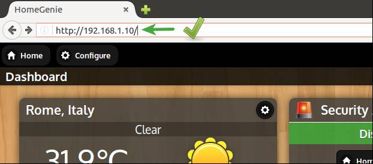
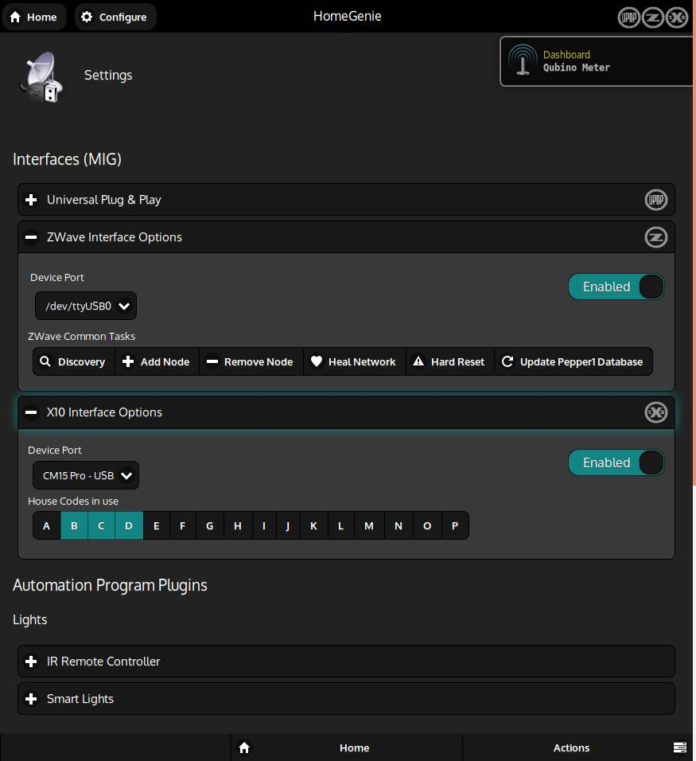

## Initial setup

After [installing HomeGenie Server](#/get_started), you can access the dashboard and the configuration
pages by entering in your web browser the address of the computer where *HG Server* is installed:

    

In the upper left corner of the user interface there are the main navigation buttons,
**<i class="material-icons">home</i>Home** and **<i class="material-icons">settings</i>Configure**,
while in the *bottom bar* there are buttons to access functionality related to the current page.

Clicking the **<i class="material-icons">home</i>Home** button will open the menu for accessing
configured groups (eg. *Dashboard*, *Living Room*, *Kitchen*, etc..) with a brief status summary for each.

Clicking the **<i class="material-icons">settings</i>Configure** button will open the menu for
accessing system configuration and administration pages.

The initial setup comes with a preset configuration consisting of some **Widgets** such as *Weather*, *Alarm System*, *Energy Monitor*, *Thermostat*
and a couple of *virtual* sensors and lights.
This preset configuration is a fully playable demo that can be useful to learn *HomeGenie* basics.

    

### System settings

In order to integrate your smart devices in *HomeGenie*, enable
the proper options in the **<i class="material-icons">build</i>Settings** page.
The picture below shows a typical setup which integrates both **X10** and **Z-Wave**
devices.

    

### Installing additional drivers and features

If smart devices or features you are looking for are not listed in the settings page,
open the *Package Manager* to search and install the missing features.

    <iframe self="size-medium" height="440" src="https://www.youtube.com/embed/rtqwI7s2Gv4?rel=0" frameborder="0" allowfullscreen></iframe>

