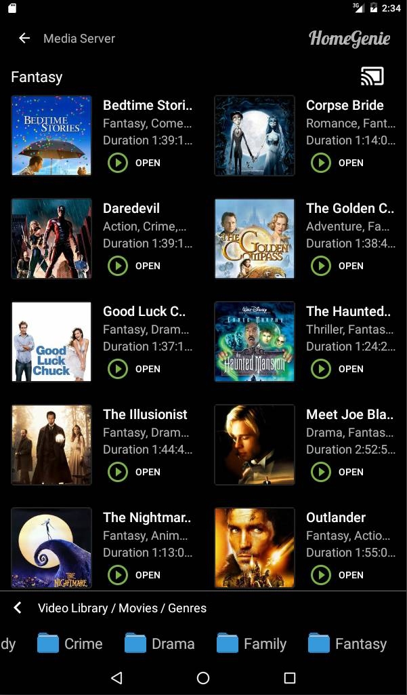
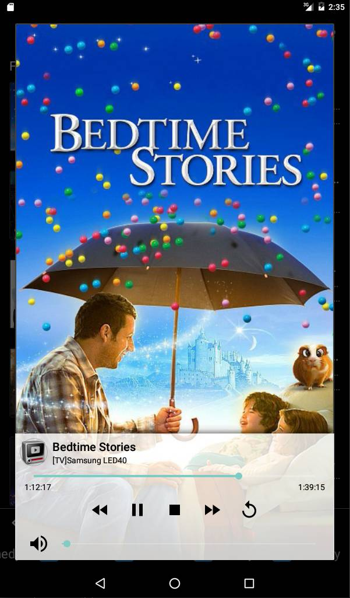
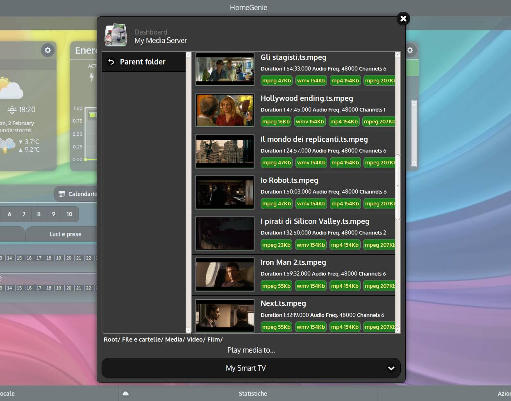

    <iframe self="size-medium" height="440" src="https://www.youtube.com/embed/ygilmTwLSJ0?rel=0" frameborder="0" allowfullscreen></iframe>

## Controlling media servers and players

HomeGenie can be used as a control point for DLNA/UPnP devices such as:

- Routers / Media Servers
- Smart TVs / Media Players
- UPnP switches and lights

Media servers and players in the network are automatically detected
and can be added like other modules to *[control groups](#/docs/configure)*.

From there we can browse media files (pictures, music and videos) and play
them to any media player/renderer in the local network.
This can be done either from the web interface or the mobile client.

DLNA/UPnP commands can also be stored in a script with *[Record Macro](#/docs/scenarios)*
functionality or manually by using *[UPnP API](api/mig/mig_api_upnp.html)*
and then recalled within a *[scenario](#/docs/scenarios)*.

    
    
    

Above screenshots are showing DLNA controls from both HomeGenie Plus (Android) and HomeGenie Server (Web UI).
