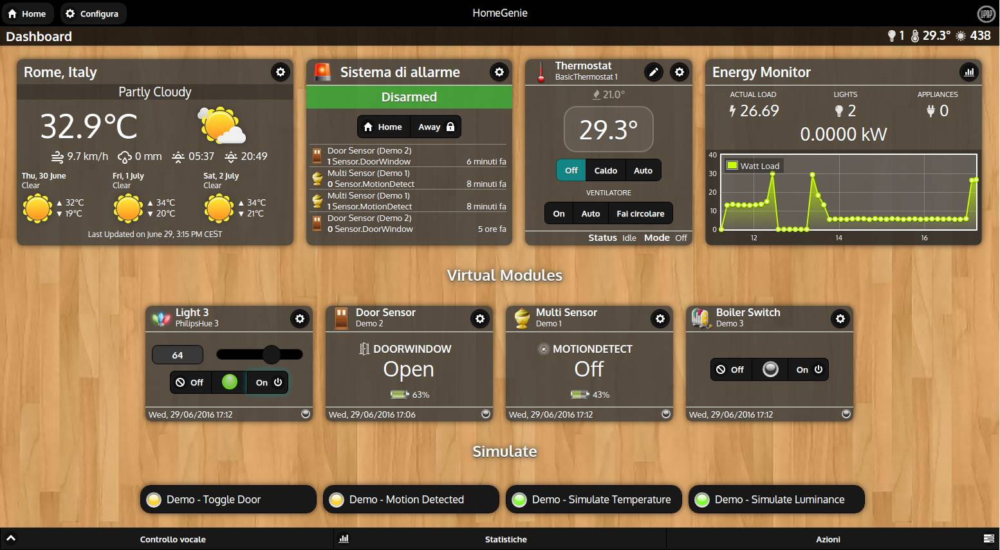
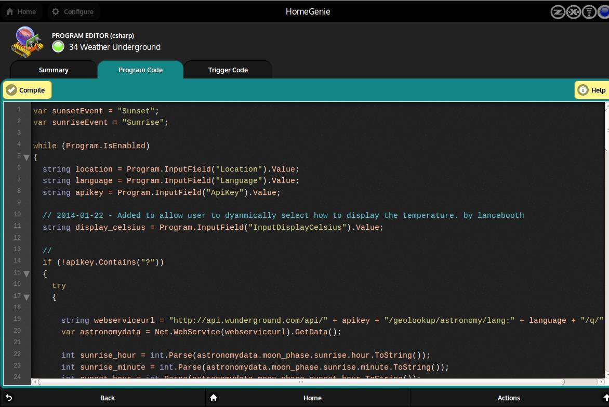
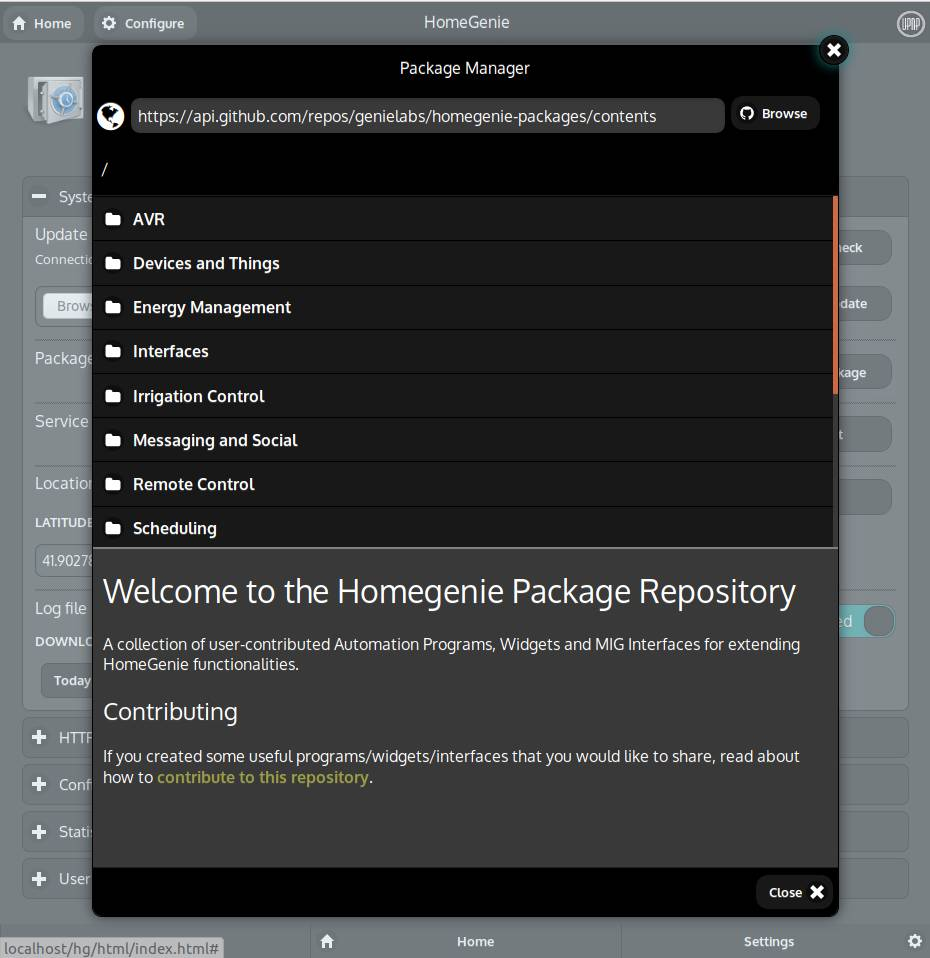

## Why HomeGenie?

We can see a bunch of new smart devices brought to the market day by day,
each of them implementing proprietary protocols and applications.
So, dealing with smart devices it often means dealing with
different applications, making home automation not that effective.

This is why *HomeGenie* server was specifically designed to find a
reasonable way of integrating current and future smart home
technologies into one single piece of software.

    

### Extensible solution that lasts

The standard server installation includes most widely spread protocols
and smart devices such as **X10**, **Z-Wave**, **Philis-Hue**.

But beside implementing most common home automation features,
*HomeGenie* also includes powerful tools for customizing your system.

With the [Program](#/develop/programs) editor and the [Widget](#/develop/widgets) editor,
improving of functionality, adding new widgets or integrating
new devices/services, can be done directly from the web user interface.

    

Already many additional widgets, drivers and automation programs are available
through the *Package Repository* that can be browsed from the web interface.

    

### Single Board Computers and GPIO/I2C/SPI support

*HomeGenie* can be installed in a few steps on most popular and inexpensive Single Board Computers
such as *Raspberry Pi*.

The [Program Editor](#/develop/programs) and its API support **GPIO**/**I2C**/**SPI**
hardware programming.

Applications and useful widgets can be found in the *SBC* section of the
<a href="https://github.com/genielabs/homegenie-packages/tree/master/packages/Single%20Board%20Computers/Raspberry%20Pi">Package Repository</a>.

### Open Source

HomeGenie server source code is publicly available on GitHub.

    
     
    <a href="https://github.com/genielabs/HomeGenie">Source code on GitHub</a>

