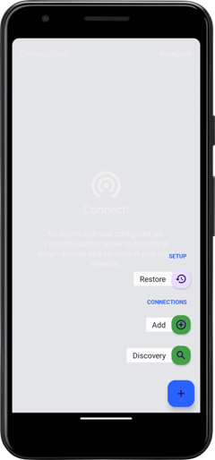
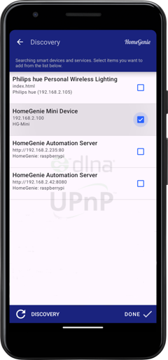
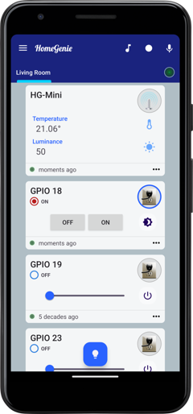
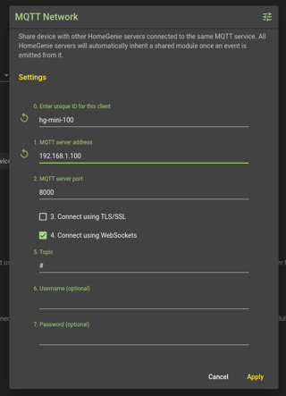
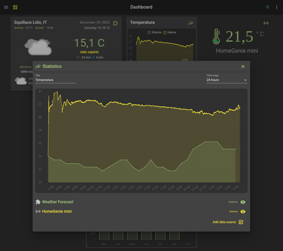

## Connecting the device

Once the firmware is installed you can configure and control the device using
the [HomeGenie Panel](../../../panel) app available on Google Play.

The device status LED will blink continuously indicating that the device is not
connected to Wi-Fi, and is in pairing mode accepting connections via Bluetooth.

Enable Bluetooth on your phone, open *HomeGenie Panel* and select the *"Discovery"* option.



The new HG-Mini device will be detected via Bluetooth and the app will display a dialog to
configure the device name and data to connect it to Wi-Fi.
After confirming the settings, the HG-Mini will exit pairing mode, reboot and connect
to Wi-Fi.  
At this point the device will blink slowly (every 2 seconds) indicating that is connected
correctly, and it will appear in the list of detected devices in the *HomeGenie Panel* app.

Select it from the list and click the *"Done"* button.



Depending on the installed firmware version you will be able to select different kind of modules
to show in the panel dashboard. The following picture refers to the `smart-sensor-d1-mini-esp32`
firmware that implements temperature and light sensor and 4 GPIO switches.




### Connecting to HomeGenie Server

HG-Mini devices can also be connected to [HomeGenie Server](../../../server)
configuring the *MQTT client* as shown in the following picture.



Is then possible to use HG-mini device for automation tasks, logging, statistics and use of all other
features available in *HomeGenie Server*.




## Monitoring via serial port

When the device is connected to your PC's USB port, you can monitor its activity logs
by entering the following command::

```bash
pio device monitor -b 115200
```

**Example output**
```
[1970-01-01T00:00:00.055Z] HomeGenie Mini 1.2.0
[1970-01-01T00:00:00.056Z] Booting...
[1970-01-01T00:00:00.057Z] + Starting HomeGenie service
[1970-01-01T00:00:00.068Z] + Starting NetManager
[1970-01-01T00:00:00.068Z] |  - Connecting to WI-FI .
[1970-01-01T00:00:00.187Z] |  - WI-FI SSID: HG-NET
[1970-01-01T00:00:00.188Z] |  - WI-FI Password: *
[1970-01-01T00:00:00.214Z] |  x WiFi disconnected
[1970-01-01T00:00:00.774Z] |  ✔ HTTP service
[1970-01-01T00:00:00.784Z] |  ✔ WebSocket server
[1970-01-01T00:00:00.786Z] |  ✔ MQTT service
[1970-01-01T00:00:00.791Z] @IO::GPIO::GPIOPort [Status.Level 0]
[1970-01-01T00:00:00.792Z] :Service::HomeGenie [IOManager::IOEvent] >> [domain 'HomeAutomation.HomeGenie' address '14' event 'Status.Level']
[1970-01-01T00:00:00.807Z] @IO::GPIO::GPIOPort [Status.Level 0]
[1970-01-01T00:00:00.809Z] :Service::HomeGenie [IOManager::IOEvent] >> [domain 'HomeAutomation.HomeGenie' address '27' event 'Status.Level']
[1970-01-01T00:00:00.822Z] READY.
[1970-01-01T00:00:00.823Z] @IO::Sys::Diagnostics [System.BytesFree 147128]
[1970-01-01T00:00:00.835Z] :Service::HomeGenie [IOManager::IOEvent] >> [domain 'HomeAutomation.HomeGenie' address 'mini' event 'System.BytesFree']
[1970-01-01T00:00:00.848Z] :Service::EventRouter dequeued event >> [domain 'HomeAutomation.HomeGenie' address 'mini' event 'System.BytesFree']
[2023-12-29T17:01:11.050Z] |  - RTC updated via TimeClient (NTP)
[2023-12-29T17:01:11.053Z] |  ✔ UPnP friendly name: Bagno
[2023-12-29T17:01:11.054Z] |  ✔ SSDP service
[2023-12-29T17:01:11.200Z] |  - Connected to 'HG-NET'
[2023-12-29T17:01:11.201Z] |  - IP: 192.168.x.y
[2023-12-29T17:01:15.048Z] @IO::Sys::Diagnostics [System.BytesFree 143268]
[2023-12-29T17:01:15.049Z] :Service::HomeGenie [IOManager::IOEvent] >> [domain 'HomeAutomation.HomeGenie' address 'mini' event 'System.BytesFree']
[2023-12-29T17:01:15.063Z] :Service::EventRouter dequeued event >> [domain 'HomeAutomation.HomeGenie' address 'mini' event 'System.BytesFree']
```

