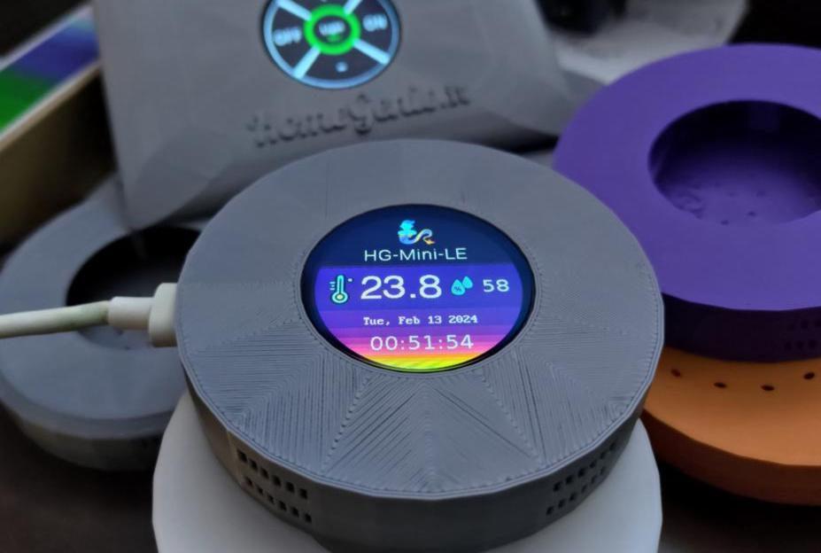

<!-- SPACER -->

&nbsp;

**HomeGenie Mini**
is an open source operating system and library for creating smart devices based on **ESP32**
or **ESP8266** SoCs.
HomeGenie-Mini devices are easy to set up, control and automate using *HomeGenie Panel* app.

The source code includes examples for implementing smart switch relays, smart sensors, a smart
shutter, an RF transceiver, and more.

    

## HG-Mini OS Features

- Easy Wi-Fi configuration using Bluetooth (ESP32) or WPA (ESP8266)
- Does not require an Internet connection to be configured or to work properly
- Time synchronization using internal RTC (ESP32), mobile app time or NTP
- Device discovery through SNMP/UPnP advertising with customizable name
- Multi-channel I/O: HTTP, WebSocket, SSE, MQTT
- Status LED
- Configuration/Pairing Button
- Builtin GPIO control API
- Switch level restore on power-on/restart
- Event router
- Multitasking
- Activity-based UI with touch and gestures support
- Minimalistic APIs for implementing tasks and for using the UI
- Extensible HTTP API
- Can connect directly to *HomeGenie Panel* either via Wi-Fi access point or hotspot/tethering
- Can be easily connected to *HomeGenie Server* via MQTT

  <a href="https://github.com/genielabs/homegenie-mini?tab=readme-ov-file#homegenie-mini-v12-esp32--esp8266" class="button-85">Get Started</a>

