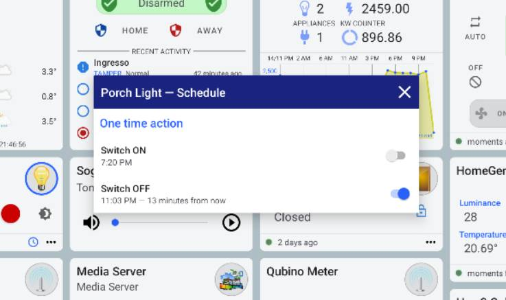
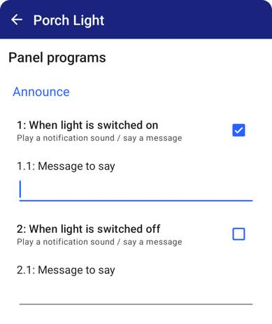

<!-- SPACER -->

&nbsp;

**HomeGenie Panel**
is a standalone app with action scheduler, script recording, voice control, capable of controlling media servers
and smart TVs and of course any HomeGenie Mini and Server devices.

With the built-in automation engine, automation API and JavaScript editor, *HomeGenie Panel* can work 24/7 and
act as *always-on* smart panel with server/gateway features.



media:

- type: image
  preview: images/hg_panel_dashboard_02.jpg
  url: images/hg_panel_dashboard_02.jpg

- type: image
  preview: images/hg_panel_dashboard_03.jpg
  url: images/hg_panel_dashboard_03.jpg

options:
- name: slide
  value: 5000
- name: inline
  value: true





  
  <!-- Google Play and the Google Play logo are trademarks of Google LLC. -->


{{ google_play }}

## Media Control Point

*HomeGenie Panel* ia also a **UPnP Control Point** capable of controlling media servers and smart TVs.



media:

- type: image
  preview: images/hg_panel_upnp_media_control_03.jpg
  url: images/hg_panel_upnp_media_control_03.jpg

- type: image
  preview: images/hg_panel_upnp_media_control_04.jpg
  url: images/hg_panel_upnp_media_control_04.jpg

- type: image
  preview: images/hg_panel_upnp_media_control_06.jpg
  url: images/hg_panel_upnp_media_control_06.jpg

options:
- name: slide
  value: 5000
- name: inline
  value: true



## Party-mode 🎶 🥳

By activating *"party-mode"*, *HomeGenie Panel* will **synchronize** the color and level
of the lights with the surrounding **sounds and music**, creating suggestive lighting effects.

    

## Script recording

*Script recording* functionality lets you **record in real time and playback commands** to
create **scenes** with ease.  
Even automatically generated commands from *party-mode*, like any other manually issued commands
to control lights, media servers and smart TVs, can also be recorded to a script and replayed
at any time with a single tap.

## Scheduled actions

With *scheduled actions* you can quickly set a timer for switching on or off lights and appliances.

    

## Programmable

HomeGenie Panel also comes with a built-in **automation engine** that allow to write programs
using **JavaScript** to extend and customize the panel functionality.

For example, it is possible to **play a sound** when a certain device is switched on, or make
the panel say something using the internal **speech synthesis**.

    

It's also possible to program **voice based interactions** by making the panel
ask something and then wait for the user reply to determine the next
action to take.

So, in a context where multiple panels are installed in different zones, each one
can have a different configuration and implement individual automation tasks
that do not involve the use of a server/gateway at all.  

{{ google_play }}
